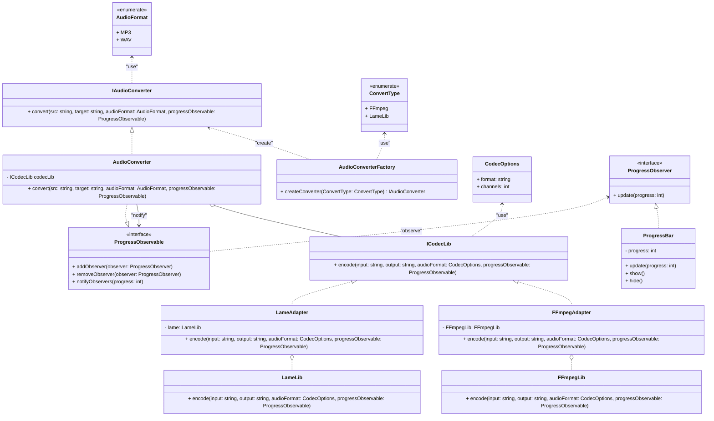

```mermaid
classDiagram

    IAudioConverter <.. AudioConverterFactory : "create"
    ConvertType <.. AudioConverterFactory : "use"

    AudioFormat <.. IAudioConverter : "use"
    IAudioConverter <|.. AudioConverter

    CodecOptions <.. ICodecLib : "use"

    ICodecLib <|.. FFmpegAdapter
    FFmpegAdapter o.. FFmpegLib 

    ICodecLib <|.. LameAdapter
    LameAdapter o.. LameLib 

    ProgressObserver <|.. ProgressBar

    AudioConverter o-- ICodecLib
    ProgressObservable <|.. AudioConverter
    AudioConverter --> ProgressObservable : "notify"
    ProgressObserver <.. ProgressObservable : "observe"

    class ConvertType {
        <<enumerate>>
        + FFmpeg
        + LameLib
    }

    class AudioFormat {
        <<enumerate>>
        + MP3
        + WAV
    }

    class AudioConverterFactory {
        + createConverter(ConvertType: ConvertType) IAudioConverter
    }

    class IAudioConverter {
        + convert(src: string, target: string, audioFormat: AudioFormat, progressObservable: ProgressObservable)
    }

    class AudioConverter {
        - ICodecLib codecLib
        + convert(src: string, target: string, audioFormat: AudioFormat, progressObservable: ProgressObservable)
    }

    class CodecOptions {
        + format: string
        + channels: int
    }

    class ICodecLib {
        + encode(input: string, output: string, audioFormat: CodecOptions, progressObservable: ProgressObservable)
    }

    class FFmpegAdapter {
        - FFmpegLib: FFmpegLib

        + encode(input: string, output: string, audioFormat: CodecOptions, progressObservable: ProgressObservable)
    }

    class LameAdapter {
        - lame: LameLib

        + encode(input: string, output: string, audioFormat: CodecOptions, progressObservable: ProgressObservable)
    }

    class FFmpegLib {
        + encode(input: string, output: string, audioFormat: CodecOptions, progressObservable: ProgressObservable)
    }

    class LameLib {
        + encode(input: string, output: string, audioFormat: CodecOptions, progressObservable: ProgressObservable)
    }

    class ProgressObservable {
        <<interface>>
        + addObserver(observer: ProgressObserver)
        + removeObserver(observer: ProgressObserver)
        + notifyObservers(progress: int)
    }

    class ProgressObserver {
        <<interface>>
        + update(progress: int)
    }

    class ProgressBar {
        - progress: int
        + update(progress: int)
        + show()
        + hide()
    }
```