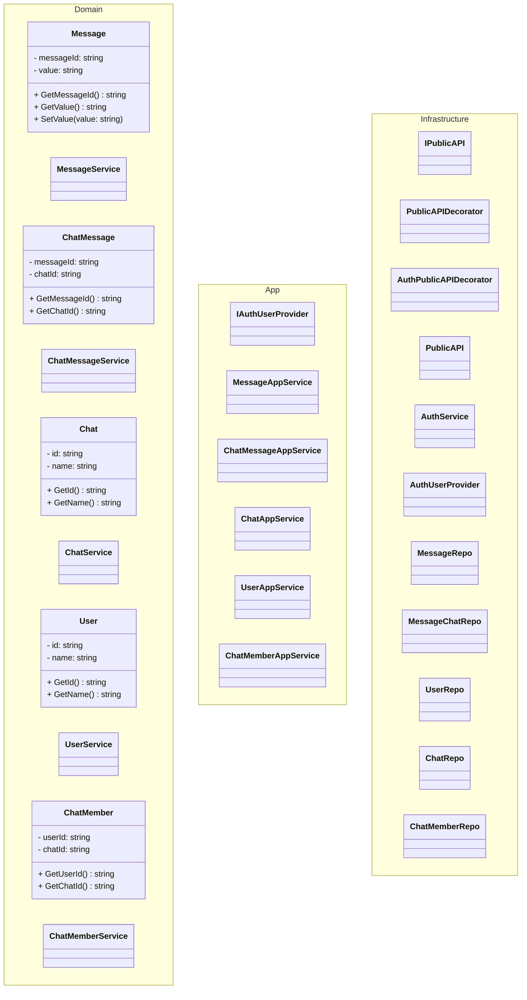

```mermaid
classDiagram

    namespace Domain {
        class Message {
            - messageId: string
            - value: string

            + GetMessageId() string
            + GetValue() string
            + SetValue(value: string)
        }

        class MessageService {
        }

        class ChatMessage {
            - messageId: string
            - chatId: string

            + GetMessageId() string
            + GetChatId() string
        }

        class ChatMessageService {

        }

        class Chat {
            - id: string
            - name: string

            + GetId() string
            + GetName() string
        }

        class ChatService {

        }

        class User {
            - id: string
            - name: string

            + GetId() string
            + GetName() string
        }

        class UserService {
            
        }

        class ChatMember {
            - userId: string
            - chatId: string

            + GetUserId() string
            + GetChatId() string
        }

        class ChatMemberService {

        }
    }

    namespace App {
        class IAuthUserProvider {

        }

        class MessageAppService {
        
        }

        class ChatMessageAppService {

        }

        class ChatAppService {

        }

        class UserAppService {
            
        } 

        class ChatMemberAppService {
            
        } 
    }

    namespace Infrastructure {
        class IPublicAPI {

        }

        class PublicAPIDecorator {

        }

        class AuthPublicAPIDecorator {

        }

        class PublicAPI {

        }

        class AuthService {

        }

        class AuthUserProvider {

        }

        class MessageRepo {
        }

        class MessageChatRepo {
        }

        class UserRepo {
        }

        class ChatRepo {
        }

        class MessageChatRepo {
        }

        class ChatMemberRepo {
            
        } 
    }

```