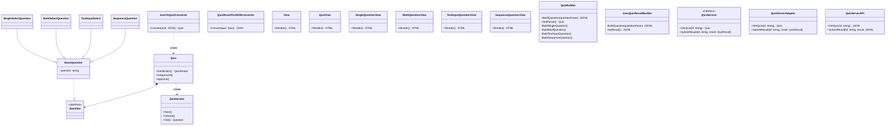

```mermaid
classDiagram
direction TB
    BaseQuestion ..|> Question
    SingleSelectQuestion --|> BaseQuestion
    MultiSelectQuestion --|> BaseQuestion
    TextInputSelect --|> BaseQuestion
    SequenceQuestion --|> BaseQuestion

    Quiz *--> Question

    Quiz ..> QuizIterator: create

    JsonToQuizConverter ..> Quiz: create

    QuizResultToJSON 


    class BaseQuestion {
        - question: string
    }

    class SingleSelectQuestion {
    }

    class MultiSelectQuestion {
    }

    class TextInputSelect {
    }

    class SequenceQuestion {
    }

    class Question {
        <<interface>>
    }

    class QuizIterator {
        +Next()
        +IsDone()
        +Get() Question
    }

    class JsonToQuizConverter {
        +Convert(json: JSON) Quiz
    }

    class QuizResultToJSONConverter {
        +Convert(quiz: Quiz) JSON
    }

    class Quiz {
        +GetIterator() QuizIterator
        +IsApproved()
        +Approve()
    }

    class View {
        +Render() HTML
    }

    class QuizView {
        +Render() HTML
    }

    class SingleQuestionView {
        +Render() HTML
    }

    class MultiQuestionView {
        +Render() HTML
    }

    class TextInputQuestionView {
        +Render() HTML
    }

    class SequenceQuestionView {
        +Render() HTML
    }

    class QuizBuilder {
        +BuildQuestion(questionParam: JSON)
        +GetResult() Quiz
        -BuildSingleQuestion()
        -BuildMultiQuestion()
        -BuildTextInputQuestion()
        -BuildSequenceQuestion()
    }

    class JsonQuizResultBuilder {
        BuildQuestion(questionParam: JSON)
        GetResult() JSON
    }

    class QuizService {
        <<interface>>
        +GetQuiz(id: string) Quiz
        +SubmitResult(id: string, result: QuizResult)
    }

    class QuizServerAdapter {
        +GetQuiz(id: string) Quiz
        +SubmitResult(id: string, result: QuizResult)
    }

    class QuizServerAPI {
        +GetQuiz(id: string) JSON
        +SubmitResult(id: string, result: JSON)
    }
```