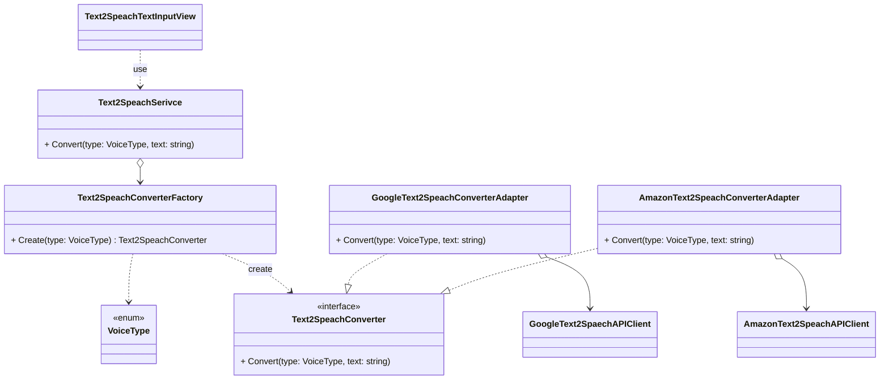

```mermaid
classDiagram
    class Text2SpeachTextInputView {

    }

    class VoiceType {
        <<enum>>
    }

    Text2SpeachTextInputView ..> Text2SpeachSerivce: use

    class Text2SpeachSerivce {
        + Convert(type: VoiceType, text: string)
    }

    Text2SpeachSerivce o--> Text2SpeachConverterFactory

    class Text2SpeachConverterFactory {
        + Create(type: VoiceType) Text2SpeachConverter
    }

    Text2SpeachConverterFactory ..> VoiceType
    Text2SpeachConverterFactory ..> Text2SpeachConverter: create

    class GoogleText2SpeachConverterAdapter {
        + Convert(type: VoiceType, text: string)
    }

    class AmazonText2SpeachConverterAdapter {
        + Convert(type: VoiceType, text: string)
    }

    class GoogleText2SpaechAPIClient {
    }

    class AmazonText2SpeachAPIClient {
    }

    class Text2SpeachConverter {
        + Convert(type: VoiceType, text: string)
    }

  <<interface>> Text2SpeachConverter

    GoogleText2SpeachConverterAdapter ..|> Text2SpeachConverter
    AmazonText2SpeachConverterAdapter ..|> Text2SpeachConverter
    GoogleText2SpeachConverterAdapter o--> GoogleText2SpaechAPIClient
    AmazonText2SpeachConverterAdapter o--> AmazonText2SpeachAPIClient

```