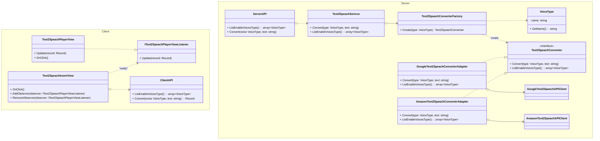

```mermaid
classDiagram

    Text2SpeachInsertView ..> IText2SpeachPlayerViewListener : "notify"
    Text2SpeachPlayerView ..|> IText2SpeachPlayerViewListener

    Text2SpeachInsertView o..> ClientAPI

    namespace Client {
        class ClientAPI {
            + ListEnableVoicesType(): array~VoiceType~
            + Convert(voice VoiceType, text: string): Record
        }

        class Text2SpeachInsertView {
            + OnClick()
            + AddObserver(observer: IText2SpeachPlayerViewListener)
            + RemoveObserver(observer: IText2SpeachPlayerViewListener)
        }

        class IText2SpeachPlayerViewListener {
            + Update(record: Record)
        }

        class Text2SpeachPlayerView {
            + Update(record: Record)
            + OnClick()
        }
    }

    Text2SpeachSerivce o--> Text2SpeachConverterFactory

    Text2SpeachConverterFactory ..> VoiceType
    Text2SpeachConverterFactory ..> Text2SpeachConverter: create

    <<interface>> Text2SpeachConverter

    GoogleText2SpeachConverterAdapter ..|> Text2SpeachConverter
    AmazonText2SpeachConverterAdapter ..|> Text2SpeachConverter
    GoogleText2SpeachConverterAdapter o--> GoogleText2SpaechAPIClient
    AmazonText2SpeachConverterAdapter o--> AmazonText2SpeachAPIClient

    ServerAPI o..> Text2SpeachSerivce

    namespace Server {
        class ServerAPI {
            + ListEnableVoicesType(): array~VoiceType~
            + Convert(voice VoiceType, text: string)
        }

        class VoiceType {
            - name: string
            + GetName(): string
        }

        class Text2SpeachSerivce {
            + Convert(type: VoiceType, text: string)
            + ListEnableVoicesType(): array~VoiceType~
        }

        class Text2SpeachConverterFactory {
            + Create(type: VoiceType) Text2SpeachConverter
        }

        class GoogleText2SpeachConverterAdapter {
            + Convert(type: VoiceType, text: string)
            + ListEnableVoicesType(): array~VoiceType~
        }

        class AmazonText2SpeachConverterAdapter {
            + Convert(type: VoiceType, text: string)
            + ListEnableVoicesType(): array~VoiceType~
        }

        class GoogleText2SpaechAPIClient {            
        }

        class AmazonText2SpeachAPIClient {
        }

        class Text2SpeachConverter {
            + Convert(type: VoiceType, text: string)
            + ListEnableVoicesType(): array~VoiceType~
        }
    }

```