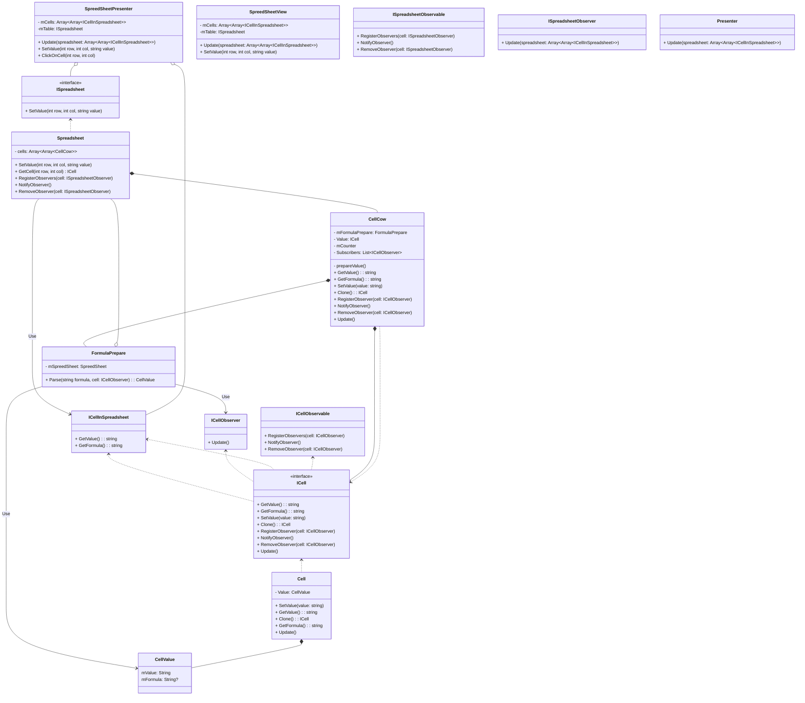

Спроектировать архитектуру программы для редактирования электронных таблиц.

1. Каждая ячейка таблицы может быть пустой, либо содержать некоторое значение или формулу.
2. Формула может состоять из операций сложения, вычитания и умножения.
3. Аргументами формул могут быть как числа, так и ссылки на ячейки таблицы.
4. При изменении значений в ячейке, значения зависящих от неё ячеек должны автоматически обновляться.

