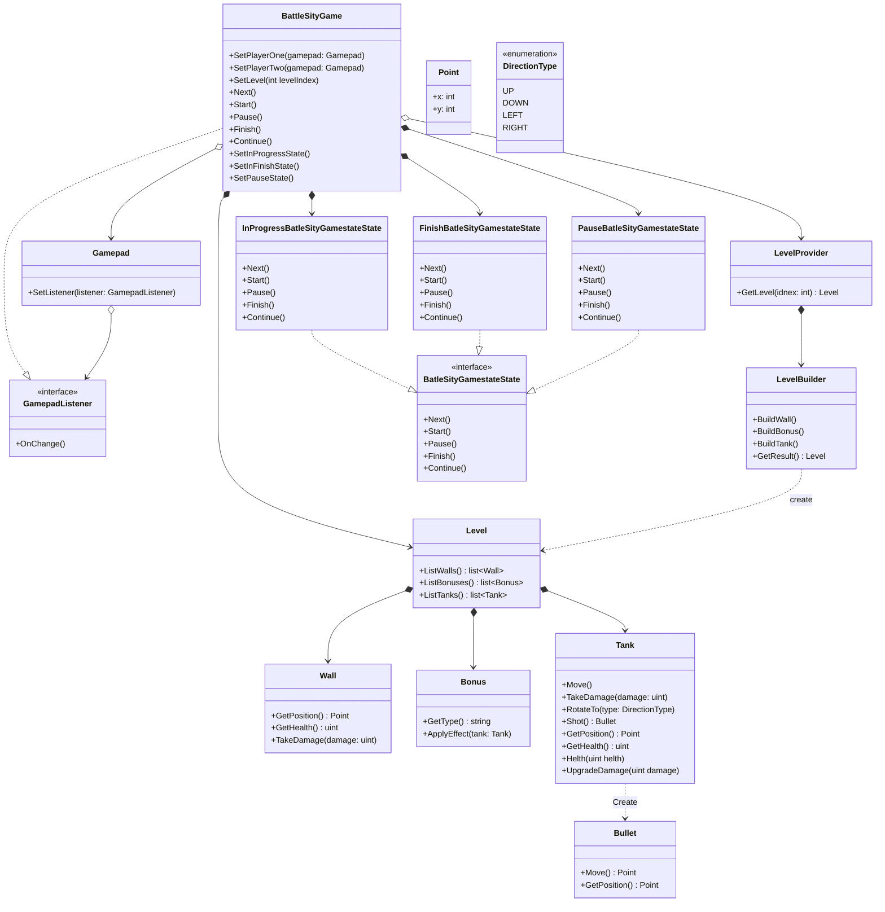

```mermaid
classDiagram
    BattleSityGame o--> LevelProvider
    BattleSityGame *--> Level
    BattleSityGame ..|>  GamepadListener
    BattleSityGame o--> Gamepad
    
    Gamepad o--> GamepadListener

    Level *--> Wall
    Level *--> Bonus
    Level *--> Tank

    LevelBuilder ..> Level : create

    LevelProvider *--> LevelBuilder

    Tank ..> Bullet: Create

    InProgressBatleSityGamestateState ..|> BatleSityGamestateState
    FinishBatleSityGamestateState ..|> BatleSityGamestateState
    PauseBatleSityGamestateState ..|> BatleSityGamestateState

    BattleSityGame *--> InProgressBatleSityGamestateState
    BattleSityGame *--> FinishBatleSityGamestateState
    BattleSityGame *--> PauseBatleSityGamestateState

    class BatleSityGamestateState {
        <<interface>>
        +Next()
        +Start()
        +Pause()
        +Finish()
        +Continue()
    }

    class InProgressBatleSityGamestateState {
        +Next()
        +Start()
        +Pause()
        +Finish()
        +Continue()
    }

    class FinishBatleSityGamestateState {
        +Next()
        +Start()
        +Pause()
        +Finish()
        +Continue()
    }

    class PauseBatleSityGamestateState {
        +Next()
        +Start()
        +Pause()
        +Finish()
        +Continue()
    }

    class BattleSityGame {
        +SetPlayerOne(gamepad: Gamepad)
        +SetPlayerTwo(gamepad: Gamepad)
        +SetLevel(int levelIndex)
        +Next()
        +Start()
        +Pause()
        +Finish()
        +Continue()
        +SetInProgressState()
        +SetInFinishState()
        +SetPauseState()
    }

    class LevelProvider {
        +GetLevel(idnex: int) Level
    }

    
    class Level {
        +ListWalls() list~Wall~
        +ListBonuses() list~Bonus~
        +ListTanks() list~Tank~
    }

    class LevelBuilder {
        +BuildWall()
        +BuildBonus()
        +BuildTank()
        +GetResult() Level
    }

    class Tank {
        +Move()
        +TakeDamage(damage: uint)
        +RotateTo(type: DirectionType)
        +Shot() Bullet
        +GetPosition() Point
        +GetHealth() uint
        +Helth(uint helth)
        +UpgradeDamage(uint damage)
    }

    class Bullet {
        +Move() Point
        +GetPosition() Point
    }

    class Bonus {
        +GetType() string
        +ApplyEffect(tank: Tank)
    }

    class GamepadListener {
        <<interface>>
        +OnChange()
    }

    class Gamepad {
        +SetListener(listener: GamepadListener)
    }

    class Wall {
        +GetPosition() Point
        +GetHealth() uint
        +TakeDamage(damage: uint)
    }

    class Point {
        +x: int
        +y: int
    }

    class DirectionType {
        <<enumeration>>
        UP
        DOWN
        LEFT
        RIGHT
    }
```