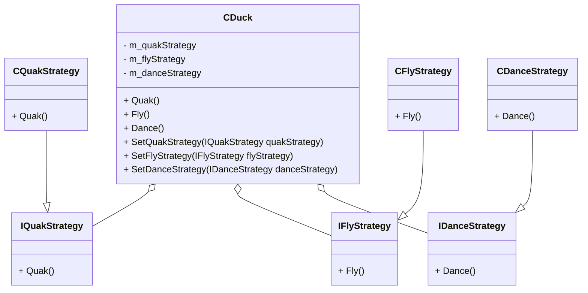

```mermaid
classDiagram
    CDuck o-- IQuakStrategy
    CDuck o-- IFlyStrategy
    CDuck o-- IDanceStrategy

    CQuakStrategy --|> IQuakStrategy
    CFlyStrategy --|> IFlyStrategy
    CDanceStrategy --|> IDanceStrategy

    class CDuck {
        + Quak()
        + Fly()
        + Dance()
        + SetQuakStrategy(IQuakStrategy quakStrategy)
        + SetFlyStrategy(IFlyStrategy flyStrategy)
        + SetDanceStrategy(IDanceStrategy danceStrategy)
        - m_quakStrategy
        - m_flyStrategy
        - m_danceStrategy
    }

    class IQuakStrategy {
        + Quak()
    }

    class CQuakStrategy {
        + Quak()
    }

    class IFlyStrategy {
        + Fly()
    }

    class CFlyStrategy {
        + Fly()
    }

    class IDanceStrategy {
        + Dance()
    }

    class CDanceStrategy {
        + Dance()
    }
```