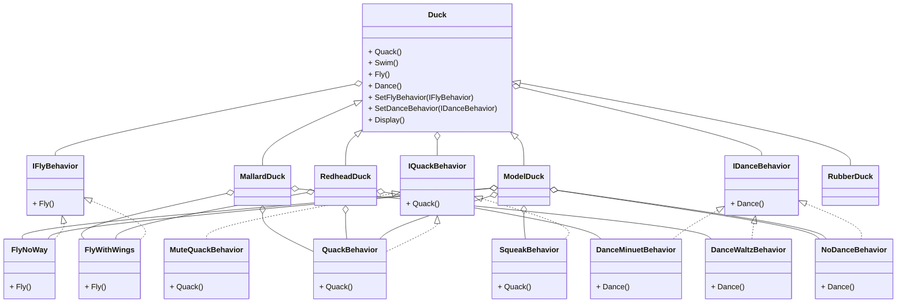
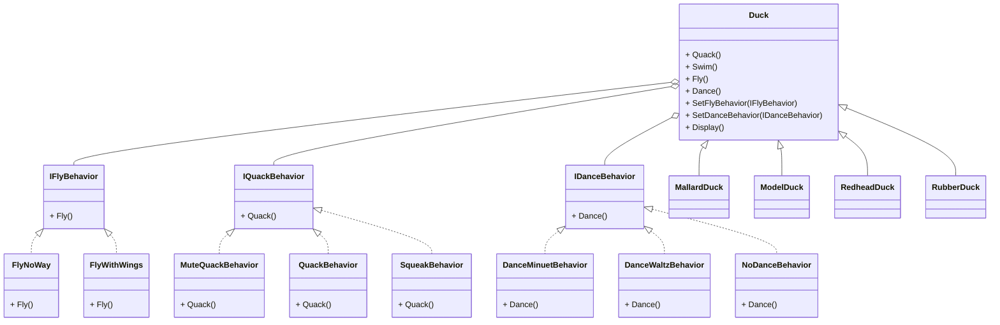

```mermaid
classDiagram
    Duck o-- IFlyBehavior
    Duck o-- IQuackBehavior
    Duck o-- IDanceBehavior

    Duck <|-- MallardDuck
    Duck <|-- ModelDuck
    Duck <|-- RedheadDuck
    Duck <|-- RubberDuck

    MallardDuck o-- FlyWithWings
    MallardDuck o-- QuackBehavior
    MallardDuck o-- DanceWaltzBehavior

    RedheadDuck o-- FlyWithWings
    RedheadDuck o-- QuackBehavior
    RedheadDuck o-- DanceMinuetBehavior

    ModelDuck o-- FlyNoWay
    ModelDuck o-- QuackBehavior
    ModelDuck o-- NoDanceBehavior

    ModelDuck o-- FlyNoWay
    ModelDuck o-- SqueakBehavior
    ModelDuck o-- NoDanceBehavior

    IFlyBehavior <|.. FlyNoWay
    IFlyBehavior <|.. FlyWithWings

    IQuackBehavior <|.. MuteQuackBehavior
    IQuackBehavior <|.. QuackBehavior
    IQuackBehavior <|.. SqueakBehavior

    IDanceBehavior <|.. DanceMinuetBehavior
    IDanceBehavior <|.. DanceWaltzBehavior
    IDanceBehavior <|.. NoDanceBehavior

    class Duck {
        + Quack()
        + Swim()
        + Fly()
        + Dance()
        + SetFlyBehavior(IFlyBehavior)
        + SetDanceBehavior(IDanceBehavior)
        + Display()
    }

    class MallardDuck {

    }

    class ModelDuck {

    }

    class RedheadDuck {

    }

    class RubberDuck {

    }

    class IFlyBehavior {
        + Fly()
    }

    class IQuackBehavior {
        + Quack()
    }

    class IDanceBehavior {
        + Dance()
    }
    
    class DanceMinuetBehavior {
        + Dance()
    }

    class DanceWaltzBehavior {
        + Dance()
    }

    class NoDanceBehavior {
        + Dance()
    }

    class MuteQuackBehavior {
        + Quack()
    }

    class QuackBehavior {
        + Quack()
    }

    class SqueakBehavior {
        + Quack()
    }

    class FlyNoWay {
        + Fly()
    }

    class FlyWithWings {
        + Fly()
    }

```

```mermaid
classDiagram
    Duck o-- IFlyBehavior
    Duck o-- IQuackBehavior
    Duck o-- IDanceBehavior

    Duck <|-- MallardDuck
    Duck <|-- ModelDuck
    Duck <|-- RedheadDuck
    Duck <|-- RubberDuck

    IFlyBehavior <|.. FlyNoWay
    IFlyBehavior <|.. FlyWithWings

    IQuackBehavior <|.. MuteQuackBehavior
    IQuackBehavior <|.. QuackBehavior
    IQuackBehavior <|.. SqueakBehavior

    IDanceBehavior <|.. DanceMinuetBehavior
    IDanceBehavior <|.. DanceWaltzBehavior
    IDanceBehavior <|.. NoDanceBehavior

    class Duck {
        + Quack()
        + Swim()
        + Fly()
        + Dance()
        + SetFlyBehavior(IFlyBehavior)
        + SetDanceBehavior(IDanceBehavior)
        + Display()
    }

    class MallardDuck {

    }

    class ModelDuck {

    }

    class RedheadDuck {

    }

    class RubberDuck {

    }

    class IFlyBehavior {
        + Fly()
    }

    class IQuackBehavior {
        + Quack()
    }

    class IDanceBehavior {
        + Dance()
    }
    
    class DanceMinuetBehavior {
        + Dance()
    }

    class DanceWaltzBehavior {
        + Dance()
    }

    class NoDanceBehavior {
        + Dance()
    }

    class MuteQuackBehavior {
        + Quack()
    }

    class QuackBehavior {
        + Quack()
    }

    class SqueakBehavior {
        + Quack()
    }

    class FlyNoWay {
        + Fly()
    }

    class FlyWithWings {
        + Fly()
    }

```
