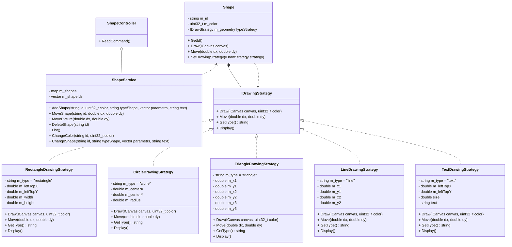

```mermaid
classDiagram
    ShapeController o-- ShapeService

    Shape <.. ShapeService

    Shape *-- IDrawingStrategy
    IDrawingStrategy <.. Shape 

    IDrawingStrategy <|.. RectangleDrawingStrategy
    IDrawingStrategy <|.. CircleDrawingStrategy
    IDrawingStrategy <|.. TriangleDrawingStrategy
    IDrawingStrategy <|.. LineDrawingStrategy
    IDrawingStrategy <|.. TextDrawingStrategy

    class ShapeController {
        + ReadCommand()
    }

    class ShapeService {
        - map<string, Shape> m_shapes
        - vector<string> m_shapeIds
        + AddShape(string id, uint32_t color, string typeShape, vector<double> parametrs, string text)
        + MoveShape(string id, double dx, double dy)
        + MovePicture(double dx, double dy)
        + DeleteShape(string id)
        + List()
        + ChangeColor(string id, uint32_t color)
        + ChangeShape(string id, string typeShape, vector<double> parametrs, string text)
    }

    class Shape {
        - string m_id
        - uint32_t m_color
        - IDrawStrategy m_geometryTypeStrategy
        + GetId()
        + Draw(ICanvas canvas)
        + Move(double dx, double dy)
        + SetDrawingStrategy(IDrawStrategy strategy)
    }

    class IDrawingStrategy {
        + Draw(ICanvas canvas, uint32_t color)
        + Move(double dx, double dy)
        + GetType() string
        + Display()
    }

    class RectangleDrawingStrategy {
        - string m_type = "rectatngle"
        - double m_leftTopX
        - double m_leftTopY
        - double m_width
        - double m_height

        + Draw(ICanvas canvas, uint32_t color)
        + Move(double dx, double dy)
        + GetType() string
        + Display()
    }

    class CircleDrawingStrategy {
        - string m_type = "cicrle"
        - double m_centerX
        - double m_centerY
        - double m_radius

        + Draw(ICanvas canvas, uint32_t color)
        + Move(double dx, double dy)
        + GetType() string
        + Display()
    }

    class TriangleDrawingStrategy {
        - string m_type = "triangle"
        - double m_x1
        - double m_y1
        - double m_x2
        - double m_y2
        - double m_x3
        - double m_y3       

        + Draw(ICanvas canvas, uint32_t color)
        + Move(double dx, double dy)
        + GetType() string
        + Display()
    }

    class LineDrawingStrategy {
        - string m_type = "line"
        - double m_x1
        - double m_y1
        - double m_x2
        - double m_y2     

        + Draw(ICanvas canvas, uint32_t color)
        + Move(double dx, double dy)
        + GetType() string
        + Display()
    }

    class TextDrawingStrategy {
        - string m_type = "text"
        - double m_leftTopX
        - double m_leftTopY
        - double size
        - string text

        + Draw(ICanvas canvas, uint32_t color)
        + Move(double dx, double dy)
        + GetType() string
        + Display()
    }


```