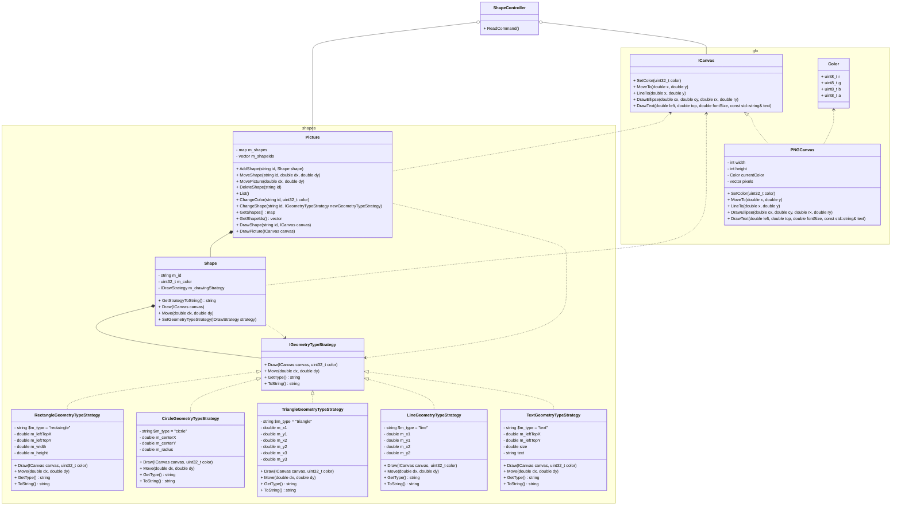

```mermaid
classDiagram
    ShapeController o-- Picture
    ShapeController o-- ICanvas

    Picture *-- Shape

    ICanvas <.. Picture
    IGeometryTypeStrategy <.. Picture

    Shape *-- IGeometryTypeStrategy
    IGeometryTypeStrategy <.. Shape 
    ICanvas <.. Shape

    IGeometryTypeStrategy <|.. RectangleGeometryTypeStrategy
    IGeometryTypeStrategy <|.. CircleGeometryTypeStrategy
    IGeometryTypeStrategy <|.. TriangleGeometryTypeStrategy
    IGeometryTypeStrategy <|.. LineGeometryTypeStrategy
    IGeometryTypeStrategy <|.. TextGeometryTypeStrategy

    class ShapeController {
        + ReadCommand()
    }

    namespace shapes {
        class Picture {
            - map<string, Shape> m_shapes
            - vector<string> m_shapeIds
            + AddShape(string id, Shape shape)
            + MoveShape(string id, double dx, double dy)
            + MovePicture(double dx, double dy)
            + DeleteShape(string id)
            + List()
            + ChangeColor(string id, uint32_t color)
            + ChangeShape(string id, IGeometryTypeStrategy newGeometryTypeStrategy)
            + GetShapes() map<string, Shape>
            + GetShapeIds() vector<string>
            + DrawShape(string id, ICanvas canvas)
            + DrawPicture(ICanvas canvas)
        }

        class Shape {
            - string m_id
            - uint32_t m_color
            - IDrawStrategy m_drawingStrategy
            + GetStrategyToString() string
            + Draw(ICanvas canvas)
            + Move(double dx, double dy)
            + SetGeometryTypeStrategy(IDrawStrategy strategy)
        }

        class IGeometryTypeStrategy {
            + Draw(ICanvas canvas, uint32_t color)
            + Move(double dx, double dy)
            + GetType() string
            + ToString() string
        }

        class RectangleGeometryTypeStrategy {
            - string $m_type = "rectatngle"
            - double m_leftTopX
            - double m_leftTopY
            - double m_width
            - double m_height

            + Draw(ICanvas canvas, uint32_t color)
            + Move(double dx, double dy)
            + GetType() string
            + ToString() string
        }

        class CircleGeometryTypeStrategy {
            - string $m_type = "cicrle"
            - double m_centerX
            - double m_centerY
            - double m_radius

            + Draw(ICanvas canvas, uint32_t color)
            + Move(double dx, double dy)
            + GetType() string
            + ToString() string
        }

        class TriangleGeometryTypeStrategy {
            - string $m_type = "triangle"
            - double m_x1
            - double m_y1
            - double m_x2
            - double m_y2
            - double m_x3
            - double m_y3       

            + Draw(ICanvas canvas, uint32_t color)
            + Move(double dx, double dy)
            + GetType() string
            + ToString() string
        }

        class LineGeometryTypeStrategy {
            - string $m_type = "line"
            - double m_x1
            - double m_y1
            - double m_x2
            - double m_y2     

            + Draw(ICanvas canvas, uint32_t color)
            + Move(double dx, double dy)
            + GetType() string
            + ToString() string
        }

        class TextGeometryTypeStrategy {
            - string $m_type = "text"
            - double m_leftTopX
            - double m_leftTopY
            - double size
            - string text

            + Draw(ICanvas canvas, uint32_t color)
            + Move(double dx, double dy)
            + GetType() string
            + ToString() string
        }
    }

    ICanvas <|.. PNGCanvas
    Color <.. PNGCanvas

    namespace gfx {
        class ICanvas {
            + SetColor(uint32_t color)
            + MoveTo(double x, double y)
            + LineTo(double x, double y)
            + DrawEllipse(double cx, double cy, double rx, double ry)
            + DrawText(double left, double top, double fontSize, const std::string& text)
        }

        class Color {
            + uint8_t r
            + uint8_t g
            + uint8_t b
            + uint8_t a
        }

        class PNGCanvas {
            - int width
            - int height
            - Color currentColor
            - vector<uint8_t> pixels

            + SetColor(uint32_t color)
            + MoveTo(double x, double y)
            + LineTo(double x, double y)
            + DrawEllipse(double cx, double cy, double rx, double ry)
            + DrawText(double left, double top, double fontSize, const std::string& text)
        }
    }
```