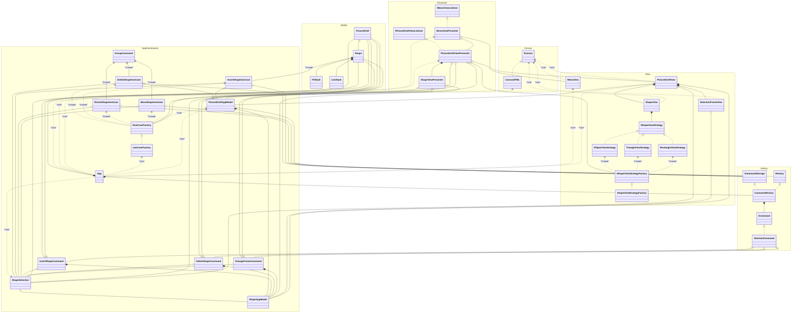

```mermaid
classDiagram
    
    PictureDraft o-- Shape
    Shape *-- FillStyle
    Shape *-- LineStyle

    namespace Model {
        class PictureDraft

        class Shape 

        class FillStyle

        class LineStyle
    }

    ICanvas <|.. CanvasSFML

    ICanvas <.. MenuView : "Use"
    ICanvas <.. PictureDraftView : "Use"
    ICanvas <.. SelectionFrameView : "Use"
    ICanvas <.. ShapeView : "Use"

    namespace Canvas {
        class ICanvas

        class CanvasSFML
    }

    PictureDraftView o-- PictureDraftAppModel
    PictureDraftView o-- ShapeSelection
    PictureDraftView *-- ShapeAppModel
    PictureDraftView *-- SelectionFrameView
    PictureDraftView *-- ShapeView

    ShapeView *-- IShapeViewStrategy
    IShapeViewStrategy <|.. RectangleViewStrategy
    IShapeViewStrategy <|.. TriangleViewStrategy
    IShapeViewStrategy <|.. EllipseViewStrategy

    IShapeViewStrategyFactory <|.. ShapeViewStrategyFactory
    RectangleViewStrategy <.. IShapeViewStrategyFactory : "Create"
    TriangleViewStrategy <.. IShapeViewStrategyFactory : "Create"
    EllipseViewStrategy <.. IShapeViewStrategyFactory : "Create"

    SelectionFrameView o-- ShapeAppModel

    namespace View {
        class IMenuViewListener

        class MenuView

        class PictureDraftView

        class SelectionFrameView

        class ShapeView

        class IShapeViewStrategy

        class RectangleViewStrategy             

        class TriangleViewStrategy

        class EllipseViewStrategy  

        class IShapeViewStrategyFactory   

        class ShapeViewStrategyFactory
    }

    IMenuViewListener <|.. MenuViewPresenter
    MenuViewPresenter o-- MenuView
    MenuViewPresenter o-- PictureDraftViewPresenter

    IPictureDraftViewListener <|.. PictureDraftViewPresenter
    PictureDraftViewPresenter o-- ShapeSelection
    PictureDraftViewPresenter o-- PictureDraftView
    PictureDraftViewPresenter o-- PictureDraftAppModel
    PictureDraftViewPresenter o-- IUseCaseFactory
    PictureDraftViewPresenter o-- IShapeViewStrategyFactory
    PictureDraftViewPresenter *-- ShapeViewPresenter

    ShapeViewPresenter o-- ShapeAppModel
    ShapeViewPresenter o-- IUseCaseFactory
    ShapeViewPresenter o-- ShapeSelection

    namespace Presenter {
        class MenuViewPresenter

        class IMenuViewListener

        class PictureDraftViewPresenter

        class IPictureDraftViewListener

        class ShapeViewPresenter
    }

    IHistory <|.. CommandHistory
    ICommandStorage <|.. CommandHistory
    CommandHistory *-- ICommand
    ICommand <|.. AbstractCommand

    namespace History {
        class IHistory

        class ICommandStorage

        class CommandHistory

        class ICommand

        class AbstractCommand
    }

    App *-- PictureDraft
    App *-- CommandHistory
    PictureDraftAppModel <.. App : "Use"
    ShapeSelection <.. App : "Use"
    PictureDraftView <.. App : "Use"
    UseCaseFactory <.. App : "Use"
    PictureDraftViewPresenter <.. App : "Use"
    MenuView <.. App : "Use"
    MenuViewPresenter <.. App : "Use"
    CanvasSFML <.. App : "Use"

    AbstractCommand <|-- ChangeFrameCommand
    ChangeFrameCommand o-- Shape
    ChangeFrameCommand o-- PictureDraft
    ChangeFrameCommand o-- ShapeSelection
    ChangeFrameCommand *-- ShapeAppModel

    AbstractCommand <|-- DeleteShapeCommand
    DeleteShapeCommand o-- Shape
    DeleteShapeCommand o-- PictureDraft
    DeleteShapeCommand o-- ShapeSelection
    DeleteShapeCommand *-- ShapeAppModel

    AbstractCommand <|-- InsertShapeCommand
    InsertShapeCommand o-- Shape
    InsertShapeCommand o-- PictureDraft
    InsertShapeCommand o-- ShapeSelection
    InsertShapeCommand *-- ShapeAppModel

    PictureDraftAppModel o-- PictureDraft
    PictureDraftAppModel o-- IHistory
    PictureDraftAppModel *-- ShapeAppModel

    ShapeSelection o-- ShapeAppModel

    MoveShapeUseCase o-- ShapeSelection
    MoveShapeUseCase o-- ICommandStorage
    GroupCommand <-- MoveShapeUseCase : "Create"

    ResizeShapeUseCase o-- ShapeSelection
    ResizeShapeUseCase o-- ICommandStorage
    GroupCommand <-- ResizeShapeUseCase : "Create"

    InsertShapeUseCase o-- PictureDraftAppModel
    InsertShapeUseCase o-- ShapeSelection
    InsertShapeUseCase o-- ICommandStorage
    Shape <-- InsertShapeUseCase : "Create"

    DeleteShapeUseCase o-- PictureDraftAppModel
    DeleteShapeUseCase o-- ShapeSelection
    DeleteShapeUseCase o-- ICommandStorage
    GroupCommand <-- DeleteShapeUseCase : "Create"

    IUseCaseFactory <|.. UseCaseFactory
    PictureDraftAppModel <.. IUseCaseFactory : "Use"
    MoveShapeUseCase <.. IUseCaseFactory : "Create"
    ResizeShapeUseCase <.. IUseCaseFactory : "Create"
    InsertShapeUseCase <.. IUseCaseFactory : "Create"
    DeleteShapeUseCase <.. IUseCaseFactory : "Create"

    namespace AppNamespace {
        class App

        class GroupCommand

        class PictureDraftAppModel

        class ShapeAppModel

        class ShapeSelection

        class InsertShapeCommand

        class ChangeFrameCommand

        class DeleteShapeCommand

        class InsertShapeUseCase

        class MoveShapeUseCase

        class ResizeShapeUseCase

        class DeleteShapeUseCase

        class IUseCaseFactory

        class UseCaseFactory
    }
```