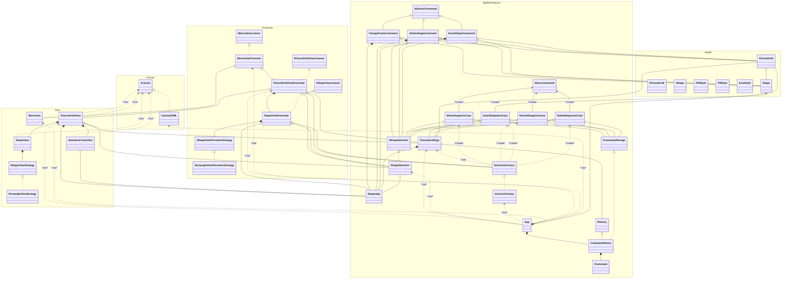

```mermaid
classDiagram
    
    PictureDraft o-- Shape

    namespace Model {
        class IPictureDraft

        class PictureDraft

        class IShape

        class Shape 

        class IFillStyle

        class FillStyle

        class ILineStyle
    }

    ICanvas <|.. CanvasSFML

    ICanvas <.. MenuView : "Use"
    ICanvas <.. PictureDraftView : "Use"
    ICanvas <.. SelectionFrameView : "Use"
    ICanvas <.. ShapeView : "Use"

    namespace Canvas {
        class ICanvas

        class CanvasSFML
    }

    PictureDraftView o-- PictureDraftApp
    PictureDraftView o-- ShapeSelection
    PictureDraftView *-- ShapeApp
    PictureDraftView *-- SelectionFrameView
    PictureDraftView *-- ShapeView

    ShapeView *-- IShapeViewStrategy
    IShapeViewStrategy <|.. RectangleViewStrategy

    SelectionFrameView o-- ShapeApp

    namespace View {
        class IMenuViewListener

        class MenuView

        class PictureDraftView

        class SelectionFrameView

        class ShapeView

        class IShapeViewStrategy

        class RectangleViewStrategy                
    }

    IMenuViewListener <|.. MenuViewPresenter
    MenuViewPresenter o-- MenuView
    MenuViewPresenter o-- PictureDraftViewPresenter

    IPictureDraftViewListener <|.. PictureDraftViewPresenter
    PictureDraftViewPresenter o-- ShapeSelection
    PictureDraftViewPresenter o-- PictureDraftView
    PictureDraftViewPresenter o-- PictureDraftApp
    PictureDraftViewPresenter o-- IUseCaseFactory
    PictureDraftViewPresenter *-- ShapeViewPresenter

    IShapeViewListener <|.. ShapeViewPresenter
    ShapeViewPresenter o-- ShapeApp
    ShapeViewPresenter o-- IUseCaseFactory
    ShapeViewPresenter o-- ShapeSelection
    ShapeViewPresenter *-- IShapeViewPresenterStrategy
    IShapeViewPresenterStrategy <|.. RectangleViewPresenterStrategy

    namespace Presenter {
        class MenuViewPresenter

        class IMenuViewListener

        class PictureDraftViewPresenter

        class IPictureDraftViewListener

        class ShapeViewPresenter

        class IShapeViewListener

        class IShapeViewPresenterStrategy

        class RectangleViewPresenterStrategy   
    }

    App *-- PictureDraft
    App *-- CommandHistory
    PictureDraftApp <.. App : "Use"
    ShapeSelection <.. App : "Use"
    PictureDraftView <.. App : "Use"
    UseCaseFactory <.. App : "Use"
    PictureDraftViewPresenter <.. App : "Use"
    MenuView <.. App : "Use"
    MenuViewPresenter <.. App : "Use"
    CanvasSFML <.. App : "Use"

    IHistory <|.. CommandHistory
    ICommandStorage <|.. CommandHistory
    CommandHistory *-- ICommand

    AbstractCommand <|-- ChangeFrameCommand
    ChangeFrameCommand o-- Shape
    ChangeFrameCommand o-- PictureDraft
    DeleteShapeCommand o-- IShapeSelection
    ChangeFrameCommand *-- ShapeApp

    AbstractCommand <|-- DeleteShapeCommand
    DeleteShapeCommand o-- Shape
    DeleteShapeCommand o-- PictureDraft
    DeleteShapeCommand o-- IShapeSelection
    DeleteShapeCommand *-- ShapeApp

    AbstractCommand <|-- InsertShapeCommand
    InsertShapeCommand o-- Shape
    InsertShapeCommand o-- PictureDraft
    InsertShapeCommand o-- IShapeSelection
    InsertShapeCommand *-- ShapeApp

    PictureDraftApp o-- PictureDraft
    PictureDraftApp o-- IHistory
    PictureDraftApp *-- ShapeApp

    IShapeSelection <|.. ShapeSelection
    ShapeSelection o-- ShapeApp

    MoveShapeUseCase o-- IShapeSelection
    MoveShapeUseCase o-- ICommandStorage
    MacroCommand <-- MoveShapeUseCase : "Create"

    ResizeShapeUseCase o-- IShapeSelection
    ResizeShapeUseCase o-- ICommandStorage
    MacroCommand <-- ResizeShapeUseCase : "Create"

    InsertShapeUseCase o-- PictureDraftApp
    InsertShapeUseCase o-- IShapeSelection
    InsertShapeUseCase o-- ICommandStorage
    Shape <-- InsertShapeUseCase : "Create"

    DeleteShapeUseCase o-- PictureDraftApp
    DeleteShapeUseCase o-- IShapeSelection
    DeleteShapeUseCase o-- ICommandStorage
    MacroCommand <-- DeleteShapeUseCase : "Create"

    IUseCaseFactory <|.. UseCaseFactory
    PictureDraftApp <.. IUseCaseFactory : "Use"
    MoveShapeUseCase <.. IUseCaseFactory : "Create"
    ResizeShapeUseCase <.. IUseCaseFactory : "Create"
    InsertShapeUseCase <.. IUseCaseFactory : "Create"
    DeleteShapeUseCase <.. IUseCaseFactory : "Create"

    namespace AppNamespace {
        class App

        class IHistory

        class ICommandStorage

        class CommandHistory

        class ICommand

        class AbstractCommand

        class MacroCommand

        class PictureDraftApp

        class ShapeApp

        class IShapeSelection

        class ShapeSelection

        class InsertShapeCommand

        class ChangeFrameCommand

        class DeleteShapeCommand

        class InsertShapeUseCase

        class MoveShapeUseCase

        class ResizeShapeUseCase

        class DeleteShapeUseCase

        class IUseCaseFactory

        class UseCaseFactory
    }
```