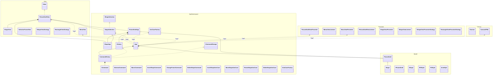

```mermaid
classDiagram
    
    PictureDraft o-- Shape

    namespace Model {
        class IPictureDraft

        class PictureDraft

        class IShape

        class Shape 

        class IFillStyle

        class FillStyle

        class ILineStyle
    }

    namespace Canvas {
        class ICanvas

        class CanvasSFML
    }

    IView <|.. PictureDraftView
    PictureDraftView o-- PictureDraftApp
    PictureDraftView o-- ShapeSelection
    PictureDraftView o-- ShapeApp
    PictureDraftView *-- ShapeView
    
    namespace View {
        class IView

        class MenuViewPresenter

        class IMenuViewListener

        class MenuView

        class PictureDraftView

        class SelectionFrameView

        class ShapeView

        class IShapeViewStrategy

        class RectangleViewStrategy                
    }

    namespace Presenter {
        class MenuViewPresenter

        class IMenuViewListener

        class PictureDraftViewPresenter

        class IPictureDraftViewListener

        class ShapeViewPresenter

        class IShapeViewListener

        class IShapeViewPresenterStrategy

        class RectangleViewPresenterStrategy   
    }

    App *-- PictureDraft
    App *-- CommandHistory
    PictureDraftApp <.. App : "Use"
    ShapeSelection <.. App : "Use"
    PictureDraftView <.. App : "Use"
    UseCaseFactory <.. App : "Use"
    PictureDraftViewPresenter <.. App : "Use"
    MenuView <.. App : "Use"
    MenuViewPresenter <.. App : "Use"
    CanvasSFML <.. App : "Use"

    IHistory <|.. CommandHistory
    ICommandStorage <|.. CommandHistory
    CommandHistory *-- ICommand

    PictureDraftApp o-- PictureDraft
    PictureDraftApp o-- IHistory
    PictureDraftApp *-- ShapeApp

    IShapeSelection <|.. ShapeSelection
    ShapeSelection o-- ShapeApp

    namespace AppNamespace {
        class App

        class IHistory

        class ICommandStorage

        class CommandHistory

        class ICommand

        class AbstractCommand

        class MacroCommand

        class PictureDraftApp

        class ShapeApp

        class IShapeSelection

        class ShapeSelection

        class InsertShapeCommand

        class ChangeFrameCommand

        class DeleteShapeCommand

        class InsertShapeUseCase

        class MoveShapeUseCase

        class ResizeShapeUseCase

        class DeleteShapeUseCase

        class IUseCaseFactory

        class UseCaseFactory
    }
```