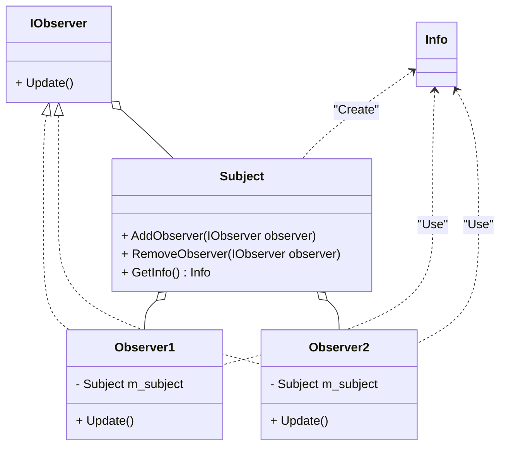
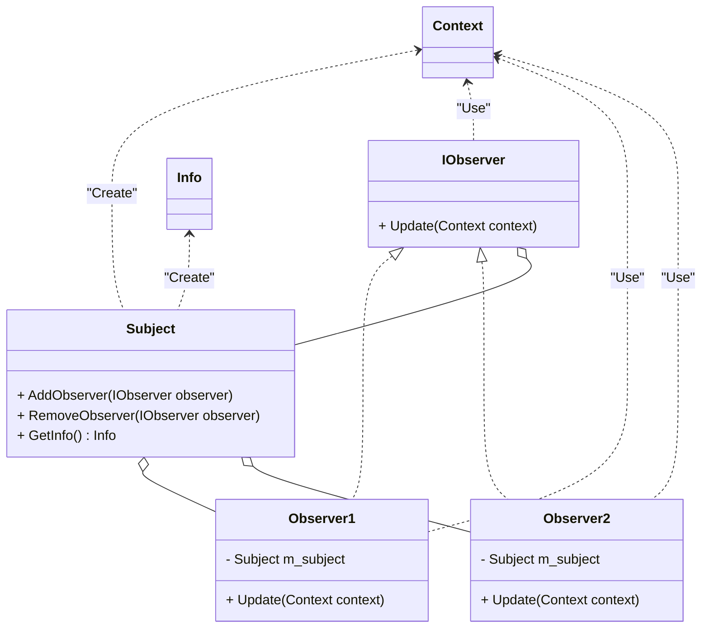
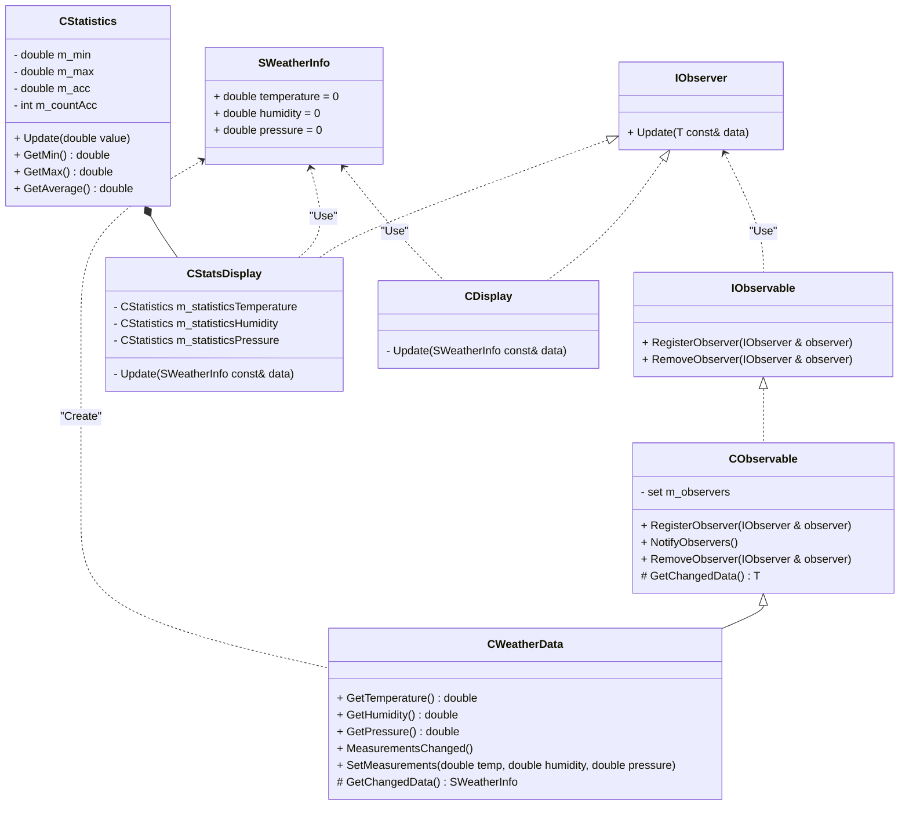
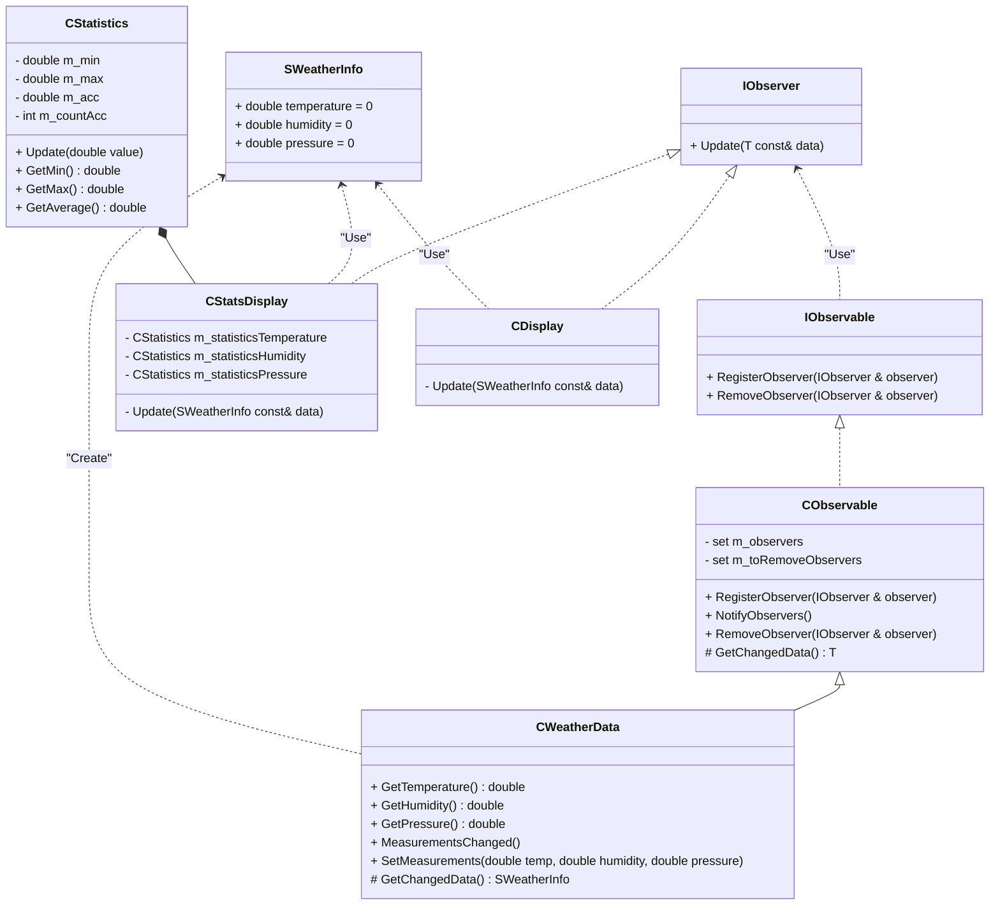
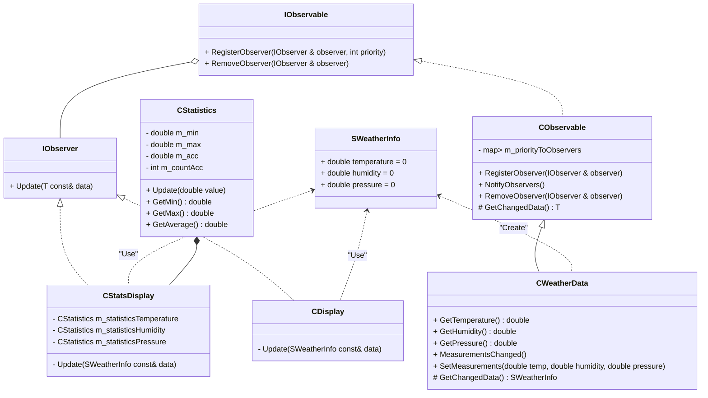

```mermaid
classDiagram
    IObserver <|.. Observer1
    IObserver <|.. Observer2

    Info <.. Subject : "Create"
    Info <.. Observer1 : "Use"
    Info <.. Observer2 : "Use"

    IObserver o-- Subject

    Subject o-- Observer1
    Subject o-- Observer2

    
    class Subject {
        + AddObserver(IObserver observer)
        + RemoveObserver(IObserver observer)
        + GetInfo() Info
    }

    class IObserver {
        + Update()
    }

    class Observer1 {
        - Subject m_subject
        + Update()
    }

    class Observer2 {
        - Subject m_subject
        + Update()
    }

    class Info {

    }
```

```mermaid
classDiagram
    IObserver <|.. Observer1
    IObserver <|.. Observer2

    Info <.. Subject : "Create"
    Context <.. Subject : "Create"

    IObserver o-- Subject

    Context <.. IObserver : "Use"

    Subject o-- Observer1
    Subject o-- Observer2

    Context <.. Observer1 : "Use"
    Context <.. Observer2 : "Use"

    
    class Subject {
        + AddObserver(IObserver observer)
        + RemoveObserver(IObserver observer)
        + GetInfo() Info
    }

    class IObserver {
        + Update(Context context)
    }

    class Observer1 {
        - Subject m_subject
        + Update(Context context)
    }

    class Observer2 {
        - Subject m_subject
        + Update(Context context)
    }

    class Info {

    }
```

```mermaid
classDiagram
    IObserver <.. IObservable  : "Use"
    IObservable <|.. CObservable 

    CObservable <|-- CWeatherData
    SWeatherInfo <.. CWeatherData : "Create"

    IObserver <|.. CStatsDisplay
    IObserver <|.. CDisplay

    SWeatherInfo <.. CStatsDisplay : "Use"
    SWeatherInfo <.. CDisplay : "Use"

    CStatistics *-- CStatsDisplay

    class IObserver {
        + Update(T const& data)
    }

    class IObservable {
        + RegisterObserver(IObserver<T> & observer)
        + RemoveObserver(IObserver<T> & observer)
    }

    class CObservable {
        - set<ObserverType*> m_observers
        + RegisterObserver(IObserver<T> & observer)
        + NotifyObservers()
        + RemoveObserver(IObserver<T> & observer)
        # GetChangedData() T
    }

    class CWeatherData {
        + GetTemperature() double
        + GetHumidity() double
        + GetPressure() double
        + MeasurementsChanged()
        + SetMeasurements(double temp, double humidity, double pressure)
        # GetChangedData() SWeatherInfo
    }

    class CDisplay {
        - Update(SWeatherInfo const& data)
    }

    class CStatsDisplay {
        - Update(SWeatherInfo const& data)
        - CStatistics m_statisticsTemperature
        - CStatistics m_statisticsHumidity
        - CStatistics m_statisticsPressure
    }

    class CStatistics {
        + Update(double value)
        + GetMin() double
        + GetMax() double
        + GetAverage() double
        - double m_min
        - double m_max
        - double m_acc
        - int m_countAcc
    }

    class SWeatherInfo {
        + double temperature = 0
        + double humidity = 0
        + double pressure = 0
    }
```

```mermaid
classDiagram
    IObserver <.. IObservable  : "Use"
    IObservable <|.. CObservable 

    CObservable <|-- CWeatherData
    SWeatherInfo <.. CWeatherData : "Create"

    IObserver <|.. CStatsDisplay
    IObserver <|.. CDisplay

    SWeatherInfo <.. CStatsDisplay : "Use"
    SWeatherInfo <.. CDisplay : "Use"

    CStatistics *-- CStatsDisplay

    class IObserver {
        + Update(T const& data)
    }

    class IObservable {
        + RegisterObserver(IObserver<T> & observer)
        + RemoveObserver(IObserver<T> & observer)
    }

    class CObservable {
        - set<ObserverType*> m_observers
        - set<ObserverType*> m_toRemoveObservers
        + RegisterObserver(IObserver<T> & observer)
        + NotifyObservers()
        + RemoveObserver(IObserver<T> & observer)
        # GetChangedData() T
    }

    class CWeatherData {
        + GetTemperature() double
        + GetHumidity() double
        + GetPressure() double
        + MeasurementsChanged()
        + SetMeasurements(double temp, double humidity, double pressure)
        # GetChangedData() SWeatherInfo
    }

    class CDisplay {
        - Update(SWeatherInfo const& data)
    }

    class CStatsDisplay {
        - Update(SWeatherInfo const& data)
        - CStatistics m_statisticsTemperature
        - CStatistics m_statisticsHumidity
        - CStatistics m_statisticsPressure
    }

    class CStatistics {
        + Update(double value)
        + GetMin() double
        + GetMax() double
        + GetAverage() double
        - double m_min
        - double m_max
        - double m_acc
        - int m_countAcc
    }

    class SWeatherInfo {
        + double temperature = 0
        + double humidity = 0
        + double pressure = 0
    }

```

```mermaid
classDiagram
    IObservable o-- IObserver
    IObservable <|.. CObservable 

    CObservable <|-- CWeatherData
    SWeatherInfo <.. CWeatherData : "Create"

    IObserver <|.. CStatsDisplay
    IObserver <|.. CDisplay

    SWeatherInfo <.. CStatsDisplay : "Use"
    SWeatherInfo <.. CDisplay : "Use"

    CStatistics *-- CStatsDisplay

    class IObserver {
        + Update(T const& data)
    }

    class IObservable {
        + RegisterObserver(IObserver<T> & observer, int priority)
        + RemoveObserver(IObserver<T> & observer)
    }

    class CObservable {
        - map<int, set<ObserverType*>> m_priorityToObservers
        + RegisterObserver(IObserver<T> & observer)
        + NotifyObservers()
        + RemoveObserver(IObserver<T> & observer)
        # GetChangedData() T
    }

    class CWeatherData {
        + GetTemperature() double
        + GetHumidity() double
        + GetPressure() double
        + MeasurementsChanged()
        + SetMeasurements(double temp, double humidity, double pressure)
        # GetChangedData() SWeatherInfo
    }

    class CDisplay {
        - Update(SWeatherInfo const& data)
    }

    class CStatsDisplay {
        - Update(SWeatherInfo const& data)
        - CStatistics m_statisticsTemperature
        - CStatistics m_statisticsHumidity
        - CStatistics m_statisticsPressure
    }

    class CStatistics {
        + Update(double value)
        + GetMin() double
        + GetMax() double
        + GetAverage() double
        - double m_min
        - double m_max
        - double m_acc
        - int m_countAcc
    }

    class SWeatherInfo {
        + double temperature = 0
        + double humidity = 0
        + double pressure = 0
    }
```