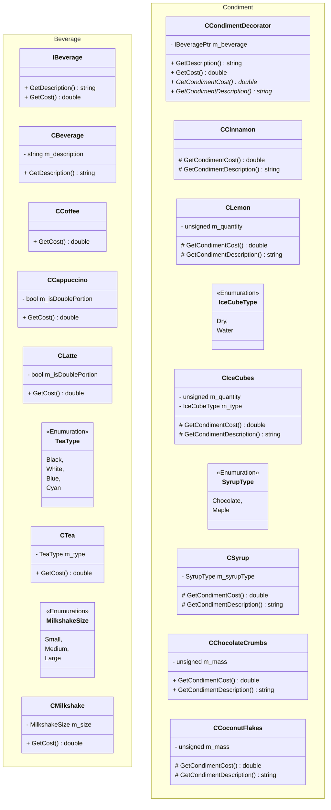

```mermaid
classDiagram

    namespace Beverage {
        class IBeverage {
            + GetDescription() string
            + GetCost() double
        }

        class CBeverage {
            + GetDescription() string
            - string m_description
        }

        class CCoffee {
            + GetCost() double
        }

        class CCappuccino {
            + GetCost() double
            - bool m_isDoublePortion
        }

        class CLatte {
            + GetCost() double
            - bool m_isDoublePortion
        }

        class TeaType {
            <<Enumuration>>
            Black,
            White,
            Blue,
            Cyan
        }

        class CTea {
            + GetCost() double
            - TeaType m_type
        }

        class MilkshakeSize {
            <<Enumuration>>
            Small,
            Medium,
            Large
        }

        class CMilkshake {
            + GetCost() double
            - MilkshakeSize m_size
        }
    }

    namespace Condiment {
        class CCondimentDecorator {
            + GetDescription() string
            + GetCost() double
            + GetCondimentCost() double*
            + GetCondimentDescription() string*
            - IBeveragePtr m_beverage
        }

        class CCinnamon {
            # GetCondimentCost() double
            # GetCondimentDescription() string
        }

        class CLemon {
            # GetCondimentCost() double
            # GetCondimentDescription() string
            - unsigned m_quantity
        }

        class IceCubeType {
            <<Enumuration>>
            Dry,
            Water
        }

        class CIceCubes {
            # GetCondimentCost() double
            # GetCondimentDescription() string
            - unsigned m_quantity
            - IceCubeType m_type
        }

        class SyrupType {
            <<Enumuration>>
            Chocolate,
            Maple
        }

        class CSyrup {
            # GetCondimentCost() double
            # GetCondimentDescription() string
            - SyrupType m_syrupType
        }

        class CChocolateCrumbs {
            + GetCondimentCost() double
            + GetCondimentDescription() string
            - unsigned m_mass
        }

        class CCoconutFlakes {
            # GetCondimentCost() double
            # GetCondimentDescription() string
            - unsigned m_mass
        }
    }
```