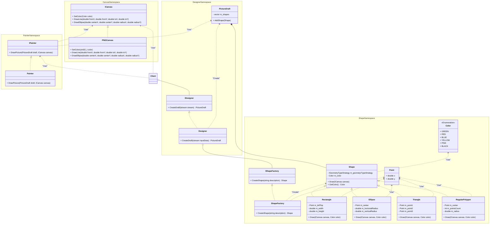

```mermaid
classDiagram

    Client o-- IDesigner
    IPainter <.. Client : "Use"
    ICanvas <.. Client : "Use"

    ICanvas <|.. PNGCanvas

    IDesigner <|.. Designer
    Designer o-- IShapeFactory
    PictureDraft <.. Designer : "Create"

    IPainter <|.. Painter
    PictureDraft <.. IPainter : "Use"
    ICanvas <.. IPainter : "Use"

    PictureDraft *-- Shape

    IShapeFactory <|.. ShapeFactory

    Color <.. Shape : "Use"        
    Shape <.. ShapeFactory : "Create"
    Shape <|.. Rectangle
    Shape <|.. Ellipse
    Shape <|.. Triangle
    Shape <|.. RegularPolygon

    Point <.. ShapeFactory : "Use"
    Point <.. Rectangle : "Use"
    Point <.. Ellipse : "Use"
    Point <.. Triangle : "Use"
    Point <.. RegularPolygon : "Use"

    class Client {
    }

    namespace PainterNamespace {
        class IPainter {
            + DrawPicture(PictureDraft draft, ICanvas canvas)
        }

        class Painter {
            + DrawPicture(PictureDraft draft, ICanvas canvas)
        }
    }

    namespace CanvasNamespace {
        class ICanvas {
            + SetColor(Color color)
            + DrawLine(double fromX, double fromY, double toX, double toY)
            + DrawEllipse(double centerX, double centerY, double radiusX, double radiusY)
        }

        class PNGCanvas {
            + SetColor(uint32_t color)
            + DrawLine(double fromX, double fromY, double toX, double toY)
            + DrawEllipse(double centerX, double centerY, double radiusX, double radiusY)
        }
    }

    namespace DesignerNamespace {
        class IDesigner {
            + CreateDraft(istream stream) PictureDraft
        }

        class Designer {
            + CreateDraft(istream inputData) PictureDraft
        }

        

        class PictureDraft {
            - vector<Shape> m_shapes

            + AddShape(Shape)
        }
    }    

    namespace ShapeNamespace {
        class Color {
            <<Enumeration>>
            + GREEN
            + RED
            + BLUE
            + YELLOW
            + PINK
            + BLACK
        }

        class IShapeFactory {
            + CreateShape(string description) Shape
        }

        class ShapeFactory {
            + CreateShape(string description) Shape
        }

        class Shape {
            - IGeometryTypeStrategy m_geometyrTypeStrategy
            - Color m_color

            + Draw(ICanvas canvas)
            + GetColor() Color 
        }

        class Rectangle {
            - Point m_leftTop
            - double m_width
            - double m_height

            + Draw(ICanvas canvas, Color color)
        }

        class Ellipse {
            - Point m_center
            - double m_horizotalRadius
            - double m_verticalRadius

            + Draw(ICanvas canvas, Color color)
        }

        class Triangle {
            - Point m_point1
            - Point m_point2
            - Point m_point3      

            + Draw(ICanvas canvas, Color color)
        }

        class RegularPolygon {
            - Point m_center
            - int m_pointsCount
            - double m_radius  

            + Draw(ICanvas canvas, Color color)
        }

        class Point {
            + double x
            + double y
        }
    }
```