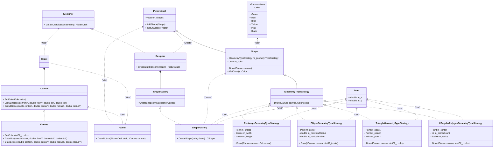

```mermaid
classDiagram

    IDesigner <.. Client : "Use"
    Painter <.. Client : "Use"
    Client *-- ICanvas

    ICanvas <|.. Canvas

    IDesigner <|.. Designer

    Designer *-- IShapeFactory
    PictureDraft <.. Designer : "Create"

    PictureDraft <.. Painter : "Use"
    ICanvas <.. Painter : "Use"

    PictureDraft o-- Shape

    IShapeFactory <|.. ShapeFactory

    Color <.. Shape : "Use"        
    Shape <.. ShapeFactory : "Create"
    Shape o-- IGeometryTypeStrategy
    IGeometryTypeStrategy <.. ShapeFactory : "Use"
    IGeometryTypeStrategy <|.. RectangleGeometryTypeStrategy
    IGeometryTypeStrategy <|.. EllipseGeometryTypeStrategy
    IGeometryTypeStrategy <|.. TriangleGeometryTypeStrategy
    IGeometryTypeStrategy <|.. CRegularPolygonGeometryTypeStrategy

    Point <.. ShapeFactory : "Use"
    Point <.. RectangleGeometryTypeStrategy : "Use"
    Point <.. EllipseGeometryTypeStrategy : "Use"
    Point <.. TriangleGeometryTypeStrategy : "Use"
    Point <.. CRegularPolygonGeometryTypeStrategy : "Use"

    class Client {
    }

    class Painter {
        + DrawPicture(PictureDraft draft, ICanvas canvas)
    }

    class ICanvas {
        + SetColor(Color color)
        + DrawLine(double fromX, double fromY, double toX, double toY)
        + DrawEllipse(double centerX, double centerY, double radiusX, double radiusY)
    }

    class Canvas {
        + SetColor(uint32_t color)
        + DrawLine(double fromX, double fromY, double toX, double toY)
        + DrawEllipse(double centerX, double centerY, double radiusX, double radiusY)
    }

    class IDesigner {
        + CreateDraft(istream stream) PictureDraft
    }

    class Designer {
        + CreateDraft(istream stream) PictureDraft
    }

    class IShapeFactory {
        + CreateShape(string descr) CShape
    }

    class ShapeFactory {
        + CreateShape(string descr) CShape
    }

    class PictureDraft {
        + AddShape(Shape)
        + GetShapes() vector<Shape>

        - vector<Shape> m_shapes
    }

    class Color {
        <<Enumeration>>
        + Green
        + Red
        + Blue
        + Yellow
        + Pink
        + Black
    }

    class Shape {
        - IGeometryTypeStrategy m_geometyrTypeStrategy
        - Color m_color

        + Draw(ICanvas canvas)
        + GetColor() Color 
    }

    class IGeometryTypeStrategy {
        + Draw(ICanvas canvas, Color color)
    }

    class RectangleGeometryTypeStrategy {
        - Point m_leftTop
        - double m_width
        - double m_height

        + Draw(ICanvas canvas, Color color)
    }

    class EllipseGeometryTypeStrategy {
        - Point m_center
        - double m_horizotalRadius
        - double m_verticalRadius

        + Draw(ICanvas canvas, uint32_t color)
    }

    class TriangleGeometryTypeStrategy {
        - Point m_point1
        - Point m_point2
        - Point m_point3      

        + Draw(ICanvas canvas, uint32_t color)
    }

    class CRegularPolygonGeometryTypeStrategy {
        - Point m_center
        - int m_pointsCount
        - double m_radius  

        + Draw(ICanvas canvas, uint32_t color)
    }

    class Point {
        + double m_x
        + double m_y
    }
```