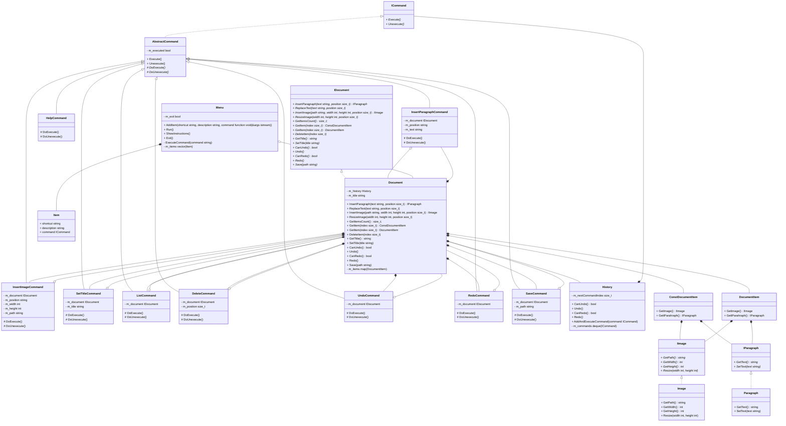

```mermaid
classDiagram
    ICommand <|.. AbstractCommand
    AbstractCommand <|-- InsertParagraphCommand
    AbstractCommand <|-- InsertImageCommand
    AbstractCommand <|-- SetTitleCommand
    AbstractCommand <|-- ListCommand
    AbstractCommand <|-- DeleteCommand
    AbstractCommand <|-- UndoCommand
    AbstractCommand <|-- RedoCommand
    AbstractCommand <|-- SaveCommand
    AbstractCommand <|-- HelpCommand

    IParagraph <|.. Paragraph
    IImage <|.. Image

    History *-- ICommand

    IDocument <|.. Document
    ConstDocumentItem *-- IImage
    ConstDocumentItem *-- IParagraph
    DocumentItem *-- IImage
    DocumentItem *-- IParagraph
    Document *-- ConstDocumentItem
    Document *-- DocumentItem
    Document *-- History
    Document *-- InsertParagraphCommand
    Document *-- InsertImageCommand
    Document *-- SetTitleCommand
    Document *-- ListCommand
    Document *-- DeleteCommand
    Document *-- UndoCommand
    Document *-- RedoCommand
    Document *-- SaveCommand

    InsertParagraphCommand o-- Document
    InsertImageCommand o-- Document
    SetTitleCommand o-- Document
    ListCommand o-- Document
    DeleteCommand o-- Document
    UndoCommand o-- Document
    RedoCommand o-- Document
    SaveCommand o-- Document
    
    Menu *-- Item
    Menu o-- Document
    

    class IDocument {
        + InsertParagraph(text string, position size_t)* IParagraph
        + ReplaceText(text string, position size_t)*
        + InsertImage(path string, width int, height int, position size_t)* IImage
        + ResizeImage(width int, height int, position size_t)*
        + GetItemsCount()* size_t;
        + GetItem(index size_t)* ConstDocumentItem
        + GetItem(index size_t)* DocumentItem
        + DeleteItem(index size_t)*
        + GetTitle()* string
        + SetTitle(title string)*
        + CanUndo()* bool
        + Undo()*
        + CanRedo()* bool
        + Redo()*
        + Save(path string)*
    }

    class Document {
        + InsertParagraph(text string, position size_t) IParagraph
        + ReplaceText(text string, position size_t)
        + InsertImage(path string, width int, height int, position size_t) IImage
        + ResizeImage(width int, height int, position size_t)
        + GetItemsCount() size_t;
        + GetItem(index size_t) ConstDocumentItem
        + GetItem(index size_t) DocumentItem
        + DeleteItem(index size_t)
        + GetTitle() string
        + SetTitle(title string)
        + CanUndo() bool
        + Undo()
        + CanRedo() bool
        + Redo()
        + Save(path string)
        - m_history History
        - m_title string
        - m_items map(DocumentItem)
    }

    class IParagraph {
        + GetText()* string
        + SetText(text string)*
    }

    class Paragraph {
        + GetText() string
        + SetText(text string)
    }

    class IImage {
        + GetPath()* string
        + GetWidth()* int
        + GetHeight()* int
        + Resize(width int, height int)*
    }

    class Image {
        + GetPath() string
        + GetWidth() int
        + GetHeight() int
        + Resize(width int, height int)
    }

    class ConstDocumentItem {
        + GetImage() IImage
        + GetIParahraph() IParagraph
    }

    class DocumentItem {
        + GetImage() IImage
        + GetIParahraph() IParagraph
    }

    class ICommand {
        + Execute()*
        + Unexecute()*
    }

    class AbstractCommand {
        + Execute()
        + Unexecute()
        # DoExecute()*
        # DoUnexecute()*
        - m_executed bool
    }

    class History {
        + CanUndo() bool
        + Undo()
        + CanRedo() bool
        + Redo()
        + AddAndExecuteCommand(command ICommand)
        - m_commands deque(ICommand)
        - m_nextCommandIndex size_t
    }

    class Menu {
        + AddItem(shortcut string, description string, command function void(&args istream))
        + Run()
        + ShowInstructions()
        + Exit()
        - ExecuteCommand(command string)
        - m_items vector(Item) 
        - m_exit bool
    }

    class Item {
        + shortcut string
        + description string
        + command ICommand
    }

    class InsertParagraphCommand {
        # DoExecute()
        # DoUnexecute()
        - m_document IDocument
        - m_position string
        - m_text string
    }

    class InsertImageCommand {
        # DoExecute()
        # DoUnexecute()
        - m_document IDocument
        - m_position string
        - m_width int
        - m_height int
        - m_path string
    }

    class SetTitleCommand {
        # DoExecute()
        # DoUnexecute()
        - m_document IDocument
        - m_title string
    }

    class ListCommand {
        # DoExecute()
        # DoUnexecute()
        - m_document IDocument
    }

    class DeleteCommand {
        # DoExecute()
        # DoUnexecute()
        - m_document IDocument
        - m_position size_t
    }

    class HelpCommand {
        # DoExecute()
        # DoUnexecute()
    }

    class UndoCommand {
        # DoExecute()
        # DoUnexecute()
        - m_document IDocument
    }

    class RedoCommand {
        # DoExecute()
        # DoUnexecute()
        - m_document IDocument
    }

    class SaveCommand {
        # DoExecute()
        # DoUnexecute()
        - m_document IDocument
        - m_path string
    }
```