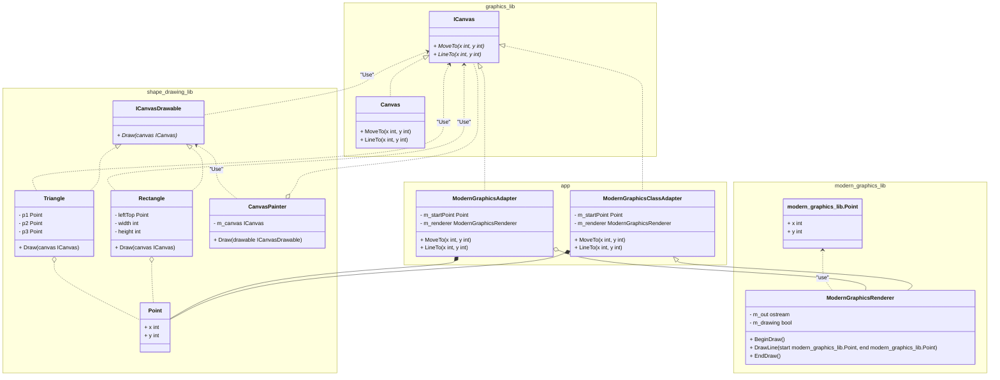

```mermaid
classDiagram
    ICanvas <|.. Canvas

    namespace graphics_lib {
        class ICanvas {
            + MoveTo(x int, y int)*
            + LineTo(x int, y int)*
        }

        class Canvas {
            + MoveTo(x int, y int)
            + LineTo(x int, y int)
        }
    }

    ICanvas <.. ICanvasDrawable : "Use"
    ICanvas <.. Triangle : "Use"
    ICanvas <.. Rectangle : "Use"
    ICanvasDrawable <|.. Triangle
    ICanvasDrawable <|.. Rectangle
    Triangle o.. Point
    Rectangle o.. Point
    CanvasPainter o.. ICanvas
    ICanvasDrawable <.. CanvasPainter : "Use"
    namespace shape_drawing_lib {
        class Point {
            + x int
            + y int
        }

        class ICanvasDrawable {
            + Draw(canvas ICanvas)*
        }

        class Triangle {
            + Draw(canvas ICanvas)
            - p1 Point
            - p2 Point
            - p3 Point
        }

        class Rectangle {
            + Draw(canvas ICanvas)
            - leftTop Point
            - width int
            - height int
        }

        class CanvasPainter {
            + Draw(drawable ICanvasDrawable)
            - m_canvas ICanvas
        }
    }

    modern_graphics_lib.Point <.. ModernGraphicsRenderer : "use"
    namespace modern_graphics_lib {
        class modern_graphics_lib.Point {
            + x int
            + y int
        }

        class ModernGraphicsRenderer {
            + BeginDraw()
            + DrawLine(start modern_graphics_lib.Point, end modern_graphics_lib.Point)
            + EndDraw()
            - m_out ostream
            - m_drawing bool
        }
    }

    ICanvas <|.. ModernGraphicsAdapter
    ModernGraphicsAdapter o-- ModernGraphicsRenderer
    ModernGraphicsAdapter *-- Point

    ICanvas <|.. ModernGraphicsClassAdapter
    ModernGraphicsClassAdapter <|-- ModernGraphicsRenderer
    ModernGraphicsClassAdapter *-- Point
    namespace app {
        class ModernGraphicsAdapter {
            + MoveTo(x int, y int)
            + LineTo(x int, y int)
            - m_startPoint Point
            - m_renderer ModernGraphicsRenderer
        }

        class ModernGraphicsClassAdapter {
            + MoveTo(x int, y int)
            + LineTo(x int, y int)
            - m_startPoint Point
            - m_renderer ModernGraphicsRenderer
        }
    }
```