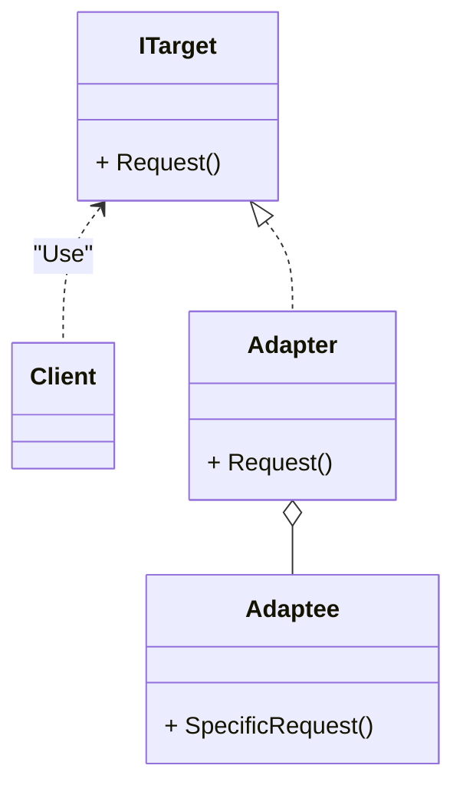
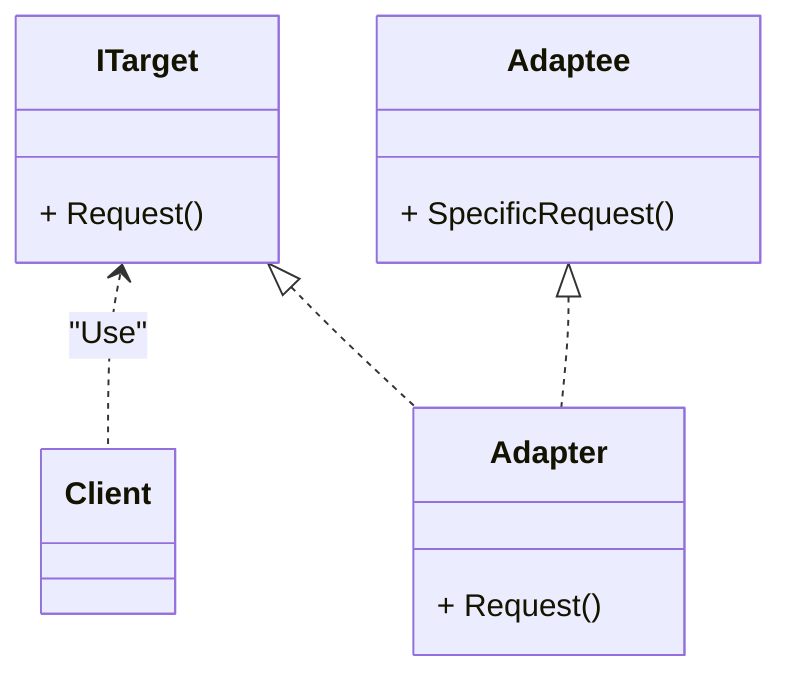
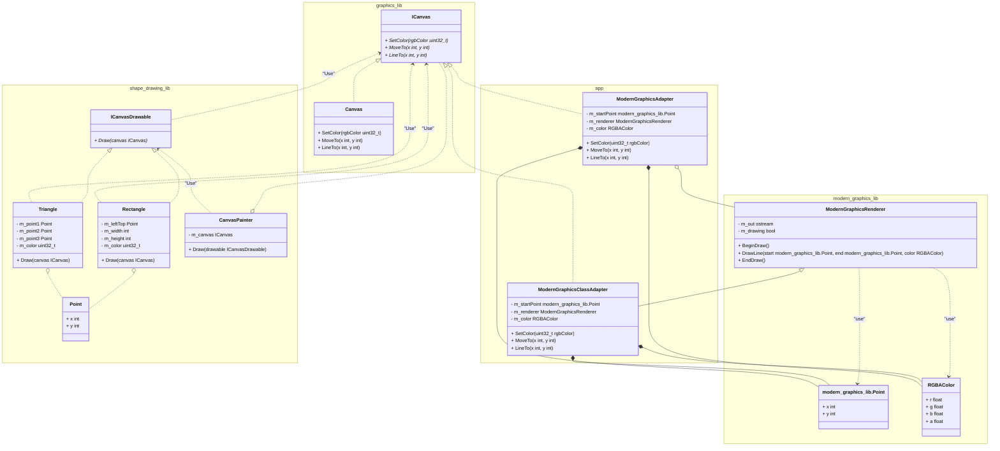

```mermaid
classDiagram
    ITarget <.. Client : "Use"
    ITarget <|.. Adapter
    Adapter o-- Adaptee

    class Client {

    }

    class ITarget {
        + Request()
    }

    class Adapter {
        + Request()
    }

    class Adaptee {
        + SpecificRequest()
    }
```

```mermaid
classDiagram
    ITarget <.. Client : "Use"
    ITarget <|.. Adapter
    Adaptee <|.. Adapter

    class Client {

    }

    class ITarget {
        + Request()
    }

    class Adapter {
        + Request()
    }

    class Adaptee {
        + SpecificRequest()
    }
```

```mermaid
classDiagram
    ICanvas <|.. Canvas

    namespace graphics_lib {
        class ICanvas {
            + SetColor(rgbColor uint32_t)*
            + MoveTo(x int, y int)*
            + LineTo(x int, y int)*
        }

        class Canvas {
            + SetColor(rgbColor uint32_t)
            + MoveTo(x int, y int)
            + LineTo(x int, y int)
        }
    }

    ICanvas <.. ICanvasDrawable : "Use"
    ICanvas <.. Triangle : "Use"
    ICanvas <.. Rectangle : "Use"
    ICanvasDrawable <|.. Triangle
    ICanvasDrawable <|.. Rectangle
    Triangle o.. Point
    Rectangle o.. Point
    CanvasPainter o.. ICanvas
    ICanvasDrawable <.. CanvasPainter : "Use"
    namespace shape_drawing_lib {
        class Point {
            + x int
            + y int
        }

        class ICanvasDrawable {
            + Draw(canvas ICanvas)*
        }

        class Triangle {
            + Draw(canvas ICanvas)
            - m_point1 Point
            - m_point2 Point
            - m_point3 Point
            - m_color uint32_t
        }

        class Rectangle {
            + Draw(canvas ICanvas)
            - m_leftTop Point
            - m_width int
            - m_height int
            - m_color uint32_t
        }

        class CanvasPainter {
            + Draw(drawable ICanvasDrawable)
            - m_canvas ICanvas
        }
    }

    modern_graphics_lib.Point <.. ModernGraphicsRenderer : "use"
    RGBAColor <.. ModernGraphicsRenderer : "use"
    namespace modern_graphics_lib {
        class RGBAColor {
            + r float
            + g float
            + b float
            + a float
        }

        class modern_graphics_lib.Point {
            + x int
            + y int
        }

        class ModernGraphicsRenderer {
            + BeginDraw()
            + DrawLine(start modern_graphics_lib.Point, end modern_graphics_lib.Point, color RGBAColor)
            + EndDraw()
            - m_out ostream
            - m_drawing bool
        }
    }

    ICanvas <|.. ModernGraphicsAdapter
    ModernGraphicsAdapter o-- ModernGraphicsRenderer
    ModernGraphicsAdapter *-- modern_graphics_lib.Point
    ModernGraphicsAdapter *-- RGBAColor

    ICanvas <|.. ModernGraphicsClassAdapter
    ModernGraphicsRenderer <|-- ModernGraphicsClassAdapter 
    ModernGraphicsClassAdapter *-- modern_graphics_lib.Point
    ModernGraphicsClassAdapter *-- RGBAColor
    namespace app {
        class ModernGraphicsAdapter {
            + SetColor(uint32_t rgbColor)
            + MoveTo(x int, y int)
            + LineTo(x int, y int)
            - m_startPoint modern_graphics_lib.Point
            - m_renderer ModernGraphicsRenderer
            - m_color RGBAColor
        }

        class ModernGraphicsClassAdapter {
            + SetColor(uint32_t rgbColor)
            + MoveTo(x int, y int)
            + LineTo(x int, y int)
            - m_startPoint modern_graphics_lib.Point
            - m_renderer ModernGraphicsRenderer
            - m_color RGBAColor
        }
    }
```