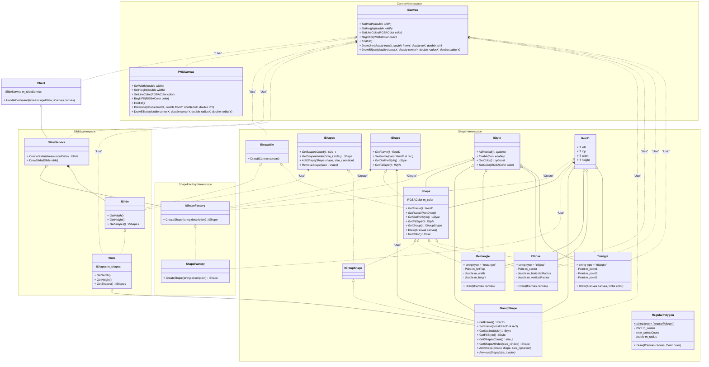

```mermaid
classDiagram
    Client o-- SlideService
    ICanvas <.. Client : "Use"

    SlideService o-- IShapeFactory
    SlideService *-- ISlide

    ICanvas <|.. PNGCanvas
    ICanvas <.. IDrawable : "Use"
    ICanvas <.. SlideService : "Use"
    ICanvas <.. Slide : "Use"
    ICanvas <.. GroupShape : "Use"
    ICanvas <.. Rectangle : "Use"
    ICanvas <.. Ellipse : "Use"
    ICanvas <.. Triangle : "Use"

    IDrawable <|.. ISlide
    ISlide <|.. Slide
    IShapes <.. ISlide : "Use"
    Slide o-- GroupShape

    IShapeFactory <|.. ShapeFactory
    IShape <.. IShapeFactory : "Create"
    IStyle <.. IShapeFactory : "Create"
    RectD <.. IShapeFactory : "Create"

    IDrawable <|.. Shape

    IShape <|.. Shape

    Shape <|.. IGroupShape
    IShapes <|.. IGroupShape
    IGroupShape <|.. GroupShape
    IShape <-- GroupShape : "Use"
    

    IStyle o-- Shape
    RectD o-- Shape
    Shape <|.. Rectangle
    Shape <|.. Ellipse
    Shape <|.. Triangle

    RectD <.. ShapeFactory : "Use"
    RectD o-- GroupShape
    RectD o-- Rectangle
    RectD o-- Ellipse
    RectD o-- Triangle
    IStyle o-- GroupShape
    IStyle o-- Rectangle
    IStyle o-- Ellipse
    IStyle o-- Triangle

    class Client {
        + HandleCommand(istream inputData, ICanvas canvas)
        - SlideService m_slideService
    }

    namespace CanvasNamespace {
        class ICanvas {
            + SetWidth(double width)*
            + SetHeight(double width)*
            + SetLineColor(RGBAColor color)*
            + BeginFill(RGBAColor color)*
            + EndFill()*
            + DrawLine(double fromX, double fromY, double toX, double toY)*
            + DrawEllipse(double centerX, double centerY, double radiusX, double radiusY)*
        }

        class PNGCanvas {
            + SetWidth(double width)
            + SetHeight(double width)
            + SetLineColor(RGBAColor color)
            + BeginFill(RGBAColor color)
            + EndFill()
            + DrawLine(double fromX, double fromY, double toX, double toY)
            + DrawEllipse(double centerX, double centerY, double radiusX, double radiusY)
        }
    }

    namespace SlideNamespace {
        class SlideService {
            + CreateSlide(istream inputData) ISlide
            + DrawSlide(ISlide slide)
        }

        class ISlide {
            + GetWidth()*
            + GetHeight()*
            + GetShapes() IShapes*
        }

        class Slide {
            + GetWidth()
            + GetHeight()
            + GetShapes() IShapes

            - IShapes m_shapes
        }
    }    

    namespace ShapeFactoryNamespace {
        class IShapeFactory {
            + CreateShape(string description) IShape
        }

        class ShapeFactory {
            + CreateShape(string description) IShape
        }
    }

    namespace ShapeNamespace {
        class RectD {
            + T left
            + T top
            + T width
            + T height
        }

        class IDrawable {
            + Draw(ICanvas canvas)
        }

        class IStyle {
            + IsEnabled() optional<bool>*
            + Enable(bool enable)*
            + GetColor() optional<RGBAColor>*
            + SetColor(RGBAColor color)*
        }

        class IShape {
            + GetFrame() RectD*
            + SetFrame(const RectD & rect)*
            + GetOutlineStyle() IStyle*
            + GetFillStyle() IStyle*
        }

        class Shape {
            + GetFrame() RectD*
            + SetFrame(RectD rect)*
            + GetOutlineStyle() IStyle*
            + GetFillStyle() IStyle*
            + GetGroup() IGroupShape*
        }

        class IShapes {
            + GetShapesCount() size_t*
            + GetShapeAtIndex(size_t index)Shape*
            + AddShape(Shape shape, size_t position)*
            + RemoveShape(size_t index)*
        }

        class IGroupShape {

        }

        class GroupShape {
            + GetFrame() RectD
            + SetFrame(const RectD & rect)
            + GetOutlineStyle() IStyle
            + GetFillStyle() IStyle
            + GetShapesCount() size_t
            + GetShapeAtIndex(size_t index) Shape
            + AddShape(Shape shape, size_t position)
            + RemoveShape(size_t index)*
        }

        class Shape {
            - RGBAColor m_color

            + Draw(ICanvas canvas)
            + GetColor() Color 
        }

        class Rectangle {
            + string type = "rectangle"$

            - Point m_leftTop
            - double m_width
            - double m_height

            + Draw(ICanvas canvas)
        }

        class Ellipse {
            + string type = "ellipse"$

            - Point m_center
            - double m_horizotalRadius
            - double m_verticalRadius

            + Draw(ICanvas canvas)
        }

        class Triangle {
            + string type = "triangle"$

            - Point m_point1
            - Point m_point2
            - Point m_point3      

            + Draw(ICanvas canvas, Color color)
        }

        class RegularPolygon {
            + string type = "regularPolygon"$

            - Point m_center
            - int m_pointsCount
            - double m_radius  

            + Draw(ICanvas canvas, Color color)
        }
    }
```