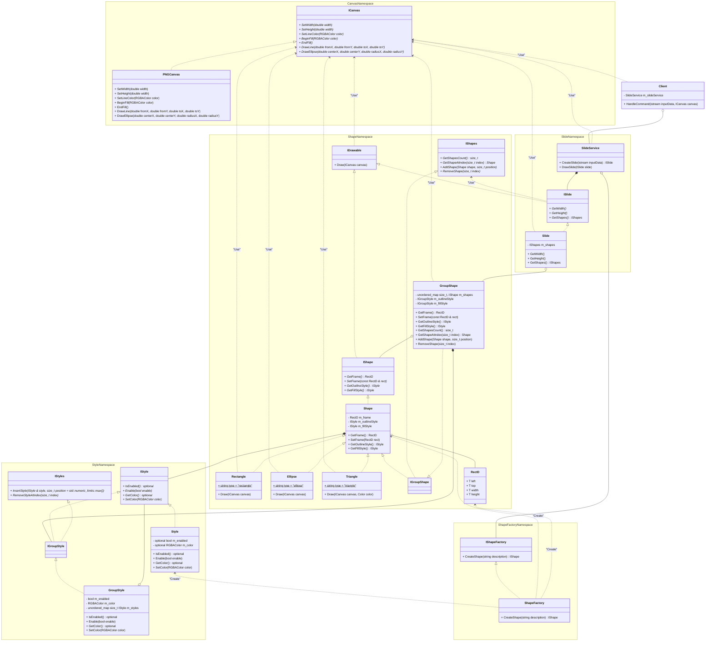

```mermaid
classDiagram
    Client o-- SlideService
    ICanvas <.. Client : "Use"

    SlideService o-- IShapeFactory
    SlideService *-- ISlide

    ICanvas <|.. PNGCanvas
    ICanvas <.. IDrawable : "Use"
    ICanvas <.. SlideService : "Use"
    ICanvas <.. Slide : "Use"
    ICanvas <.. GroupShape : "Use"
    ICanvas <.. Rectangle : "Use"
    ICanvas <.. Ellipse : "Use"
    ICanvas <.. Triangle : "Use"

    IDrawable <|.. ISlide
    ISlide <|.. Slide
    IShapes <.. ISlide : "Use"
    Slide o-- GroupShape

    IDrawable <|.. IShape
    IShape <|.. Shape
    
    Shape <|.. IGroupShape
    IShapes <|.. IGroupShape
    IGroupShape <|.. GroupShape
    GroupShape o-- IShape
    GroupShape *-- IGroupStyle

    IStyle <|.. Style
    GroupStyle o-- IStyle
    IStyle <|.. IGroupStyle
    IStyles <|.. IGroupStyle
    IGroupStyle <|.. GroupStyle

    Shape *-- IStyle
    Shape o-- RectD 
    Shape <|.. Rectangle
    Shape <|.. Ellipse
    Shape <|.. Triangle

    IShapeFactory <|.. ShapeFactory
    Shape <.. ShapeFactory : "Create"
    Style <.. ShapeFactory : "Create"
    RectD <.. ShapeFactory : "Create"

    class Client {
        + HandleCommand(istream inputData, ICanvas canvas)
        - SlideService m_slideService
    }

    namespace CanvasNamespace {
        class ICanvas {
            + SetWidth(double width)*
            + SetHeight(double width)*
            + SetLineColor(RGBAColor color)*
            + BeginFill(RGBAColor color)*
            + EndFill()*
            + DrawLine(double fromX, double fromY, double toX, double toY)*
            + DrawEllipse(double centerX, double centerY, double radiusX, double radiusY)*
        }

        class PNGCanvas {
            + SetWidth(double width)
            + SetHeight(double width)
            + SetLineColor(RGBAColor color)
            + BeginFill(RGBAColor color)
            + EndFill()
            + DrawLine(double fromX, double fromY, double toX, double toY)
            + DrawEllipse(double centerX, double centerY, double radiusX, double radiusY)
        }
    }

    namespace SlideNamespace {
        class SlideService {
            + CreateSlide(istream inputData) ISlide
            + DrawSlide(ISlide slide)
        }

        class ISlide {
            + GetWidth()*
            + GetHeight()*
            + GetShapes() IShapes*
        }

        class Slide {
            + GetWidth()
            + GetHeight()
            + GetShapes() IShapes

            - IShapes m_shapes
        }
    }    

    namespace ShapeFactoryNamespace {
        class IShapeFactory {
            + CreateShape(string description) IShape
        }

        class ShapeFactory {
            + CreateShape(string description) IShape
        }
    }

    namespace StyleNamespace {
        class IStyles {
            + InsertStyle(IStyle & style, size_t position = std::numeric_limits<size_t>::max())*
            + RemoveStyleAtIndex(size_t index) *
        }

        class IGroupStyle {

        }

        class IStyle {
            + IsEnabled() optional<bool>*
            + Enable(bool enable)*
            + GetColor() optional<RGBAColor>*
            + SetColor(RGBAColor color)*
        }

        class Style {
            + IsEnabled() optional<bool>
            + Enable(bool enable)
            + GetColor() optional<RGBAColor>
            + SetColor(RGBAColor color)

            - optional bool  m_enabled
            - optional RGBAColor m_color
        }

        class GroupStyle {
            + IsEnabled() optional<bool>
            + Enable(bool enable)
            + GetColor() optional<RGBAColor>
            + SetColor(RGBAColor color)

            - bool m_enabled
            - RGBAColor m_color
            - unordered_map size_t IStyle m_styles
        }
    }

    namespace ShapeNamespace {
        class RectD {
            + T left
            + T top
            + T width
            + T height
        }

        class IDrawable {
            + Draw(ICanvas canvas)
        }

        class IShape {
            + GetFrame() RectD*
            + SetFrame(const RectD & rect)*
            + GetOutlineStyle() IStyle*
            + GetFillStyle() IStyle*
        }

        class Shape {
            + GetFrame() RectD
            + SetFrame(RectD rect)
            + GetOutlineStyle() IStyle
            + GetFillStyle() IStyle

            - RectD m_frame
            - IStyle m_outlineStyle
            - IStyle m_fillStyle
        }

        class IShapes {
            + GetShapesCount() size_t*
            + GetShapeAtIndex(size_t index)Shape*
            + AddShape(Shape shape, size_t position)*
            + RemoveShape(size_t index)*
        }

        class IGroupShape {

        }

        class GroupShape {
            + GetFrame() RectD
            + SetFrame(const RectD & rect)
            + GetOutlineStyle() IStyle
            + GetFillStyle() IStyle
            + GetShapesCount() size_t
            + GetShapeAtIndex(size_t index) Shape
            + AddShape(Shape shape, size_t position)
            + RemoveShape(size_t index)
            
            - unordered_map size_t, IShape m_shapes
            - IGroupStyle m_outlineStyle
            - IGroupStyle m_fillStyle
        }

        class Rectangle {
            + string type = "rectangle"$
            + Draw(ICanvas canvas)
        }

        class Ellipse {
            + string type = "ellipse"$
            + Draw(ICanvas canvas)
        }

        class Triangle {
            + string type = "triangle"$
            + Draw(ICanvas canvas, Color color)
        }
    }
```