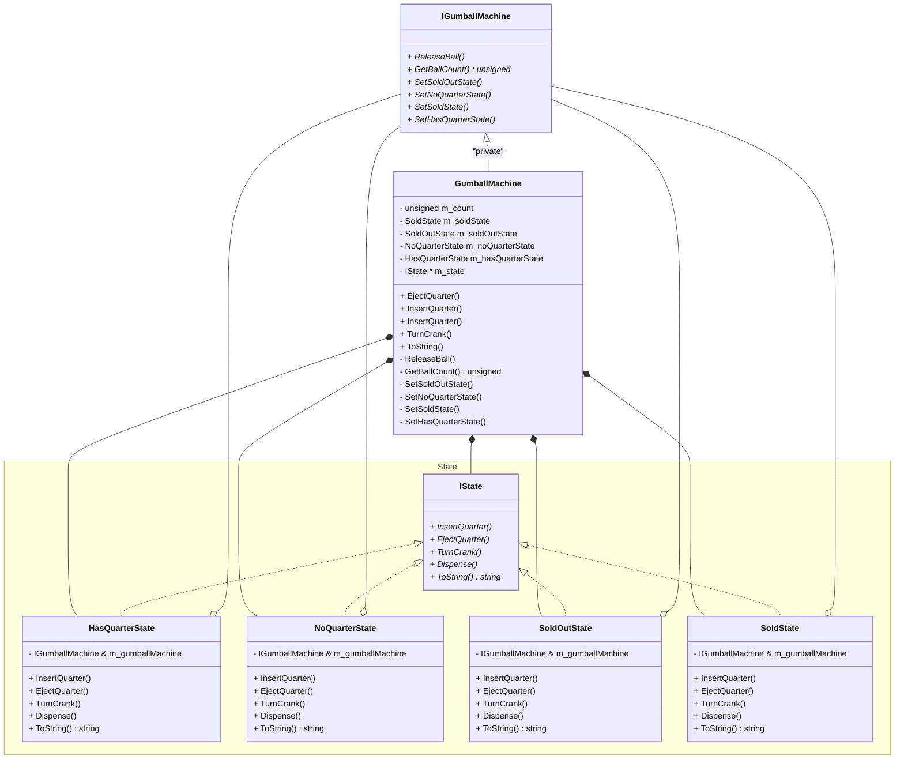

```mermaid
classDiagram
    IGumballMachine <|.. GumballMachine : "private"
    GumballMachine *-- IState
    GumballMachine *-- HasQuarterState
    GumballMachine *-- NoQuarterState
    GumballMachine *-- SoldOutState
    GumballMachine *-- SoldState

    class IGumballMachine {
        + ReleaseBall()*
        + GetBallCount() unsigned*
        + SetSoldOutState()*
        + SetNoQuarterState()*
        + SetSoldState()*
        + SetHasQuarterState()*
    }

    class GumballMachine {
        + EjectQuarter()
        + InsertQuarter()
        + InsertQuarter()
        + TurnCrank()
        + ToString()
        - ReleaseBall()
        - GetBallCount() unsigned
        - SetSoldOutState()
        - SetNoQuarterState()
        - SetSoldState()
        - SetHasQuarterState()

        - unsigned m_count
        - SoldState m_soldState
        - SoldOutState m_soldOutState
        - NoQuarterState m_noQuarterState
        - HasQuarterState m_hasQuarterState
        - IState * m_state
    }

    IState <|.. HasQuarterState
    IState <|.. NoQuarterState
    IState <|.. SoldOutState
    IState <|.. SoldState

    HasQuarterState o-- IGumballMachine
    NoQuarterState o-- IGumballMachine
    SoldOutState o-- IGumballMachine
    SoldState o-- IGumballMachine

    namespace State {
        class IState {
            + InsertQuarter()*
            + EjectQuarter()*
            + TurnCrank()*
            + Dispense()*
            + ToString() string*
        }

        class HasQuarterState {
            + InsertQuarter()
            + EjectQuarter()
            + TurnCrank()
            + Dispense()
            + ToString() string

            - IGumballMachine & m_gumballMachine
        }

        class NoQuarterState {
            + InsertQuarter()
            + EjectQuarter()
            + TurnCrank()
            + Dispense()
            + ToString() string

            - IGumballMachine & m_gumballMachine
        }

        class SoldOutState {
            + InsertQuarter()
            + EjectQuarter()
            + TurnCrank()
            + Dispense()
            + ToString() string

            - IGumballMachine & m_gumballMachine
        }

        class SoldState {
            + InsertQuarter()
            + EjectQuarter()
            + TurnCrank()
            + Dispense()
            + ToString() string

            - IGumballMachine & m_gumballMachine
        }
    }
```